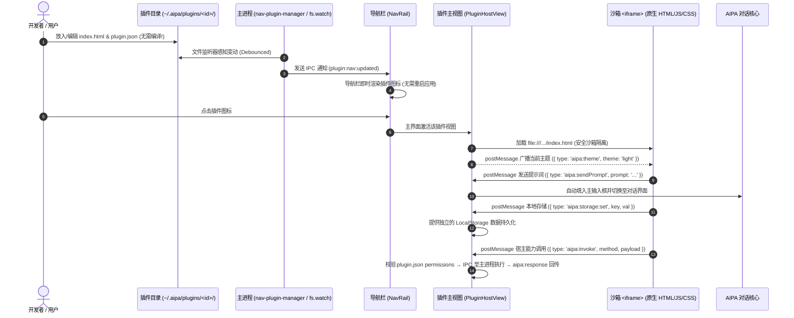
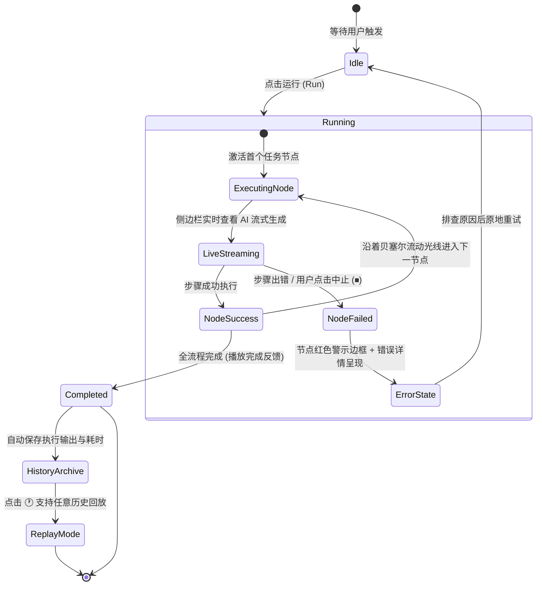

<p align="center">
  <h1 align="center">AIPA</h1>
  <p align="center">
    <strong>AI 个人助手 — 你的全天候桌面智能驾驶舱</strong><br/>
    随问随答，随需随做，驱动终端与代码，事事搞定。
  </p>
  <p align="center">
    
    
    
    
    
  </p>
</p>

---

AIPA 不是一个简单的网页套壳聊天窗口，而是一个真正驻留在你桌面上的**执行级智能代理**。它能读写本地文件、执行 Shell 终端指令、智能调度工作流、管理自动化任务，并跨会话保留记忆与偏好。

底座原生驱动 **OpenAI Codex CLI** 与 **Claude Code CLI** 作为双核执行引擎，外包一层精心打磨的 Electron + React 驾驶舱，同时无缝兼容 OpenAI、DeepSeek、Ollama 及任意 OpenAI 兼容模型。

> 💡 **CLI 是强劲引擎，AIPA 是直观易用的智能驾驶舱。**

---

## 🏛️ 系统架构总览

```mermaid
graph TB
    subgraph Desktop["🖥️ 用户桌面环境 (Windows 10/11)"]
        subgraph ElectronCockpit["🚀 AIPA 智能驾驶舱 (Electron + React)"]
            subgraph Renderer["渲染层 (React 18 + Vite + Zustand)"]
                NavRail["左侧主导航 (NavRail)"]
                MainView["主界面沉浸视图 (MainView)"]
                ChatPanel["结构化对话 / 工具卡片 / LCS Diff"]
                DeptDashboard["部门看板 (Department)"]
                EmpGallery["员工形象磁贴网格 (Employees)"]
                CanvasWorkflow["画布工作流编辑器 (Canvas Engine)"]
                PluginHost["沙箱插件宿主 (Sandboxed iframe)"]
            end
            
            subgraph Preload["安全隔离层 (Preload / contextBridge)"]
                API["window.electronAPI (IPC 强类型通信)"]
            end
            
            subgraph MainProcess["主进程 (Node.js CJS)"]
                PtyMgr["PTY 管理器 (node-pty ConPTY)"]
                CodexBridge["Codex 桥接器 (JSON-RPC 2.0 stdio)"]
                StreamBridge["Claude 桥接器 (NDJSON Stream)"]
                NavPluginMgr["插件热插拔监听 (fs.watch)"]
                ConfigMgr["安全配置管理 (DPAPI 加密)"]
                ClawdPet["桌面宠物集成 (Clawd Win32)"]
            end
        end

        subgraph Engines["⚡ 执行引擎与模型服务"]
            CodexCLI["OpenAI Codex CLI (Rust 原生内核 · 主引擎)"]
            ClaudeCLI["Claude Code CLI (备用引擎)"]
            LLMProviders["多模型接入 (OpenAI / Claude / DeepSeek / Ollama / 千问)"]
        end

        subgraph LocalEnv["💻 本地操作系统能力"]
            Shell["终端执行 (PowerShell / Git Bash / CMD)"]
            FS["本地工作区文件系统 (原子读写 / 差异比对)"]
            Git["Git 版本控制 / Worktree 工作区隔离"]
            MemoryStore["持久记忆存储 (~/.claude/projects / memdir)"]
        end
    end

    Renderer -->|postMessage / IPC| Preload
    Preload -->|IPC Channel| MainProcess
    MainProcess -->|JSON-RPC 2.0 stdio| CodexCLI
    MainProcess -->|NDJSON stdio| ClaudeCLI
    MainProcess -->|HTTP / SSE| LLMProviders
    CodexCLI --> Shell & FS & Git
    ClaudeCLI --> Shell & FS & Git & MemoryStore
```



---

## 🖥️ 桌面交互空间布局

AIPA 采用现代**双栏无缝驾驶舱布局**，去除了繁琐的中间列表栏，使所有核心业务视图均可在主界面中以全屏沉浸模式操作：

```text
┌────────────────────────────────────────────────────────────────────────────────────────┐
│  AIPA — 桌面智能代理驾驶舱                                                      ─  □  ✕  │
├──────┬─────────────────────────────────────────────────────────────────────────────────┤
│ [🏢] │ 部门看板 / 结构化交互主界面                                                     │
│ 部门 │ ┌─────────────────────────────────────────────────────────────────────────────┐ │
│      │ │ 🤖 Assistant                                                                │ │
│ [👥] │ │ 正在为项目重构文件结构...                                                   │ │
│ 员工 │ │ ┌─ 🛠️ Tool: Write (src/main/plugins/nav-plugin-manager.ts) ───────────────┐ │ │
│      │ │ │ + export interface NavPluginManifest { ... }                           │ │ │
│ [🧩] │ │ └────────────────────────────────────────────────────────────────────────┘ │ │
│ 技能 │ └─────────────────────────────────────────────────────────────────────────────┘ │
│      │                                                                                 │
│ [🧠] │ ┌─ 员工形象中心 (Employees Grid) ─────────────────────────────────────────────┐ │
│ 记忆 │ │  ┌─────────┐   ┌─────────┐   ┌─────────┐   ┌─────────┐   ┌─────────┐        │ │
│      │ │  │ 👨‍💻 导师  │   │ 👩‍🔬 分析  │   │ 🎨 创意  │   │ 📚 助教  │   │ ⚡ 效能  │        │ │
│ [📅] │ │  │ Writing │   │ Research│   │ Creative│   │  Tutor  │   │Productiv│        │ │
│ 日历 │ │  └─────────┘   └─────────┘   └─────────┘   └─────────┘   └─────────┘        │ │
│      │ └─────────────────────────────────────────────────────────────────────────────┘ │
│ ───  │                                                                                 │
│ [📝] │ ┌─ Canvas 工作流画布 ─────────────────────────────────────────────────────────┐ │
│ 笔记 │ │  [Node: 读取需求] ──(流动边线)──> [Node: 代码审查] ──(完成)──> [Node: 生成报告]  │ │
│ [🔌] │ └─────────────────────────────────────────────────────────────────────────────┘ │
│ 插件 │                                                                                 │
│ [⚙️]  │ 状态栏: ● 就绪 | 思考深度: 中 | 权限模式: Accept Edits | 消费: $0.04           [🐱 桌宠]│
└──────┴─────────────────────────────────────────────────────────────────────────────────┘
```

---

## 🌟 核心能力矩阵

| 模块 | 核心特性 | 呈现与交互形态 |
|---|---|---|
| **💬 智能对话与执行** | Stream-JSON 极速流式传输、双模型切换、思考链折叠展开、上下文自动压缩与时间差清理 | 结构化工具调用卡片、LCS 增量 Diff 视图、待办任务进度条、执行审批对话框 |
| **👥 员工 (Employees)** | 角色拟人化形象、职业特征定制、发型/服饰/表情自适应、在线状态光圈 | 响应式自适应图标网格（Icon Grid），支持悬停升起、快捷编辑与一键设为当前会话 |
| **🎨 Canvas 工作流** | 多步提示词流水线编排、节点连线拓扑图、实时流式输出预览、历史运行记录回放 | 无限缩放点阵画布、流向贝塞尔曲线动画、错误感知红框、双击原地重命名 |
| **🔌 免编译热插��插件** | 纯 HTML5+CSS+JS 架构、沙箱安全隔离、双向 postMessage SDK、目录实时监听 | 侧边栏动态图标注册、免构建即改即生效、主界面独立宿主、系统工具栏（刷新/源码） |
| **🧩 插件中心 (Plugin Hub)** | 集中展示、一键激活、查看源码、快速开发指引与插件目录管理 | 预置在左侧栏底部，支持跨插件跳转通信与目录直达 |
| **📝 便签笔记插件 (Notes)** | 模块化热插拔插件架构、Markdown 即写即看、多分类归档、置顶、一键联动 AI 对话 | 独立免编译 HTML 微应用、侧边栏底部快速唤出、Ctrl+3 / Ctrl+Shift+N 快捷绑定 |
| **📅 工作日历插件 (Work Calendar)** | 月历跨天任务条、拖动创建任务、Codex 流式生成周报/月报、GitHub 与本地文件夹工作源、人天周/月统计 | 周列报告状态徽标一键生成、报告预览/重新生成/一键拉取、数据本地文件持久化与 JSON 导入导出 |
| **🧠 记忆与指令体系** | 全局记忆、项目记忆 (`.claude/MEMORY.md`)、结构化条目 (User/Feedback/Project/Ref) | 四 Tab 记忆工作台、DreamTask 自动整合感知、记忆新鲜度衰减圆点 |
| **🐱 Clawd 桌面宠物** | 原生 Win32 桌宠联动，感知 AI 思考、工具调用与空闲发呆等真实状态 | 任务栏图标智能合并、随身动效、轻量无遮挡 |
| **⚙️ 设置与通道生态** | MCP 工具服务器、OpenClaw/外部消息通道、模型密钥、权限规则集中管控 | 整合至设置中心（Settings → MCP / 通道），精简导航专注核心生产力 |

---

## 🔌 免编译热插拔插件系统

AIPA 拥有极简、高可用的**免编译插件体系**。无需配置 Node.js、Vite、Webpack 等繁琐的构建链，使用任何文本编辑器编写原生 HTML/JS/CSS，保存即可实时生效：



### 宿主能力（`aipa:invoke`）
插件在 `plugin.json` 的 `permissions` 中声明所需能力后，即可通过 `postMessage({ type: 'aipa:invoke', requestId, method, payload })` 调用主进程能力，结果以 `{ type: 'aipa:response', requestId, ok, result | error }` 返回。宿主（PluginHostView）与主进程会双重校验权限。

| method | 权限 | 说明 |
|---|---|---|
| `data.get` / `data.set` | `storage` | 文件持久化，写入 `~/.aipa/plugin-data/<pluginId>/<key>.json`（原子写） |
| `github.commits` | `network` | 主进程调用 GitHub commits API（支持分支/作者过滤/Token，20 秒超时） |
| `fs.pickFolder` / `fs.scanFolder` | `fs` | 原生目录选择；按修改时间与 `*.ext` 过滤扫描文件变更（跳过 node_modules/.git 等） |
| `ai.generate` / `ai.abort` | `ai` | 以只读沙箱 + ephemeral 线程运行一次 Codex，经 `aipa:ai:event`（delta/status/done/error）流式回传 |

随应用发布的多文件插件放在 `electron-ui/src/main/plugins/builtin/<dir>/`，构建时由 `npm run build:plugins` 复制到 `dist`，启动时自动安装到 `~/.aipa/plugins/`；仅当内置版本号更高时才覆盖升级，插件数据保存在 `plugin-data` 中不受升级影响。

### 插件目录规范
每个插件只需一个普通文件夹，存放在 `~/.aipa/plugins/<id>/`：
```text
~/.aipa/plugins/
├── welcome/               # 🧩 插件中心 (系统预置，浏览/管理插件生态)
│   ├── plugin.json
│   └── index.html
├── notes/                 # 📝 便签笔记 (官方热插拔插件，Markdown + AI 对话联动)
│   ├── plugin.json
│   └── index.html
├── work-calendar/         # 📅 工作日历 (官方预置，任务日历 + AI 周报/月报 + 工作源 + 人天)
│   ├── plugin.json
│   ├── index.html
│   ├── style.css
│   └── js/                # bridge / store / generation / views/*
└── <custom-plugin>/       # 🛠️ 你的专属微工具 (免编译即写即用)
    ├── plugin.json        # 插件清单（名称、图标、摆放位置）
    ├── index.html         # 界面主入口（纯 HTML5）
    ├── style.css          # 样式文件（可直接使用宿主 CSS 变量）
    └── app.js             # 业务逻辑（通过 window.postMessage 与宿主通信）
```

### 🧩 官方预置插件示例
1. **插件中心 (Plugin Hub)**：提供全局已安装插件仪表盘、一键进入/直达各插件视图、直接打开源码文件夹、以及极简 3 步开发者扩展指引。
2. **便签笔记 (Quick Notes)**：从原有固定组件解耦为标准免编译插件，具备双栏编辑/预览、分类标签过滤（工作/灵感/学习/提示词/待办）、卡片置顶、以及「🤖 发送给 AI」一键联动主对话框深度分析。
3. **工作日历 (Work Calendar)**：由原飞书 aPaaS 全栈应用（NestJS + PostgreSQL + React）迁移而来，改为纯前端插件 + 宿主能力：
   - **日历**：周一对齐月视图，跨天任务条按 lane 布局；点击日期或按住拖动创建任务，点任务条编辑/删除；底部为当日任务面板。
   - **AI 周报/月报**：周列时钟图标一键生成该周周报（素材 = 周期内任务 + 绑定工作源的提交/文件变更），左上角图标由本月周报合并生成月报；Codex 流式预览，完成后自动保存；预览弹窗支持「一键拉取」「重新生成」（覆盖原报告）、复制与发送到对话继续润色。
   - **工作源**：GitHub 仓库（owner/repo 或仓库地址、分支、作者过滤、Token）与本地文件夹（原生选择目录、文件过滤），可拉取本周并查看结果；删除工作源会自动解绑任务。
   - **提醒**：原左侧栏「任务」面板的提醒功能迁入此处，支持 N 分钟后、指定时间与 cron 周期提醒；由主进程后台调度，插件未打开也会弹出系统通知，点击通知直达工作日历。原「任务」面板已移除，旧待办与提醒在首次启动时自动导入工作日历，`Ctrl+7` 现在打开工作日历。
   - **任务 / 报告 / 人天**：任务统计卡、筛选、行内改状态；历史报告查看/编辑/导出 .md；人天周视图增删改与「从任务自动生成」（5 个工作日按 0.5 步进均摊），月视图按周聚合。
   - **设置**：生成模型、周报/月报提示词模板（`{{period}}` / `{{material}}`），数据 JSON 导入导出（不含 Token）。未登录 Codex 且未配置 API Key 时会立即提示，而不是无限重试。

---

## 👥 员工 (Employees) 形象化设计

摒弃了传统单调、占空间的文本卡片列表，AIPA 全面采用了具有生动视觉特征的 **拟人化人物图标网格**：

```text
                  ┌──────────────────────────────────────────────┐
                  │          主题色径向渐变底衬 (Glow)           │
                  │                                              │
                  │                 ╭───────────╮                │
                  │                │ 💇 定制发型 │                │
                  │                │(科技短发/波波头/卷发/中分)   │
                  │                 ╭───────────╮                │
                  │                │  👀 灵动眼眸│                │
                  │                │  😊 亲切微笑│                │
                  │                 ╰───────────╯                │
                  │               👔 角色专属职业服饰            │
                  │            (西装/高领毛衣/连帽衫/学士领)     │
                  │                                              │
                  │                            ┌───────────┐     │
                  │   🟢 在线状态光环          │ ✍️ 职业徽标│     │
                  │   (Active Status Ring)     │(笔/显微镜/画板) │
                  │                            └───────────┘     │
                  └──────────────────────────────────────────────┘
```

- **发型与职业风貌**：写作导师（知性短发）、数据分析师（利落波波头）、创意伙伴（艺术卷发与发带）、学习助教（严谨中分）。
- **交互质感**：自适应磁贴（Icon Tile），自适应容器宽度排布，鼠标滑过柔和浮起，支持一键切换当前对话 Persona。

---

## 🎨 Canvas 工作流引擎

可视化工作流画布支持将复杂的多步 AI 任务连接为自动化执���流：



- **无限画布体验**：支持拖拽平移、滚轮缩放、节点折叠/展开、框选与双击原地修改标题。
- **坐标持久化**：自定义排布坐标即时保存至 `canvasPos`，重开页面保持完美布局。

---

## 🧠 分层记忆与自主整合

AIPA 拥有类似人类记忆的层次化沉淀机制，有效防止多轮对话后的上下文遗忘：


---

## ⌨️ 效率快捷键速查

| 快捷键 | 功能描述 | 快捷键 | 功能描述 |
|---|---|---|---|
| `Ctrl+N` | 新建对话 | `Ctrl+Shift+P` | 唤起全局命令面板 |
| `Ctrl+K` | 会话快速切换器（模糊搜索） | `Ctrl+F` | 检索当前会话内容 |
| `Ctrl+Shift+F` | 全局跨会话文件搜索 | `Ctrl+Shift+R` | 重新生成回复（可换模型） |
| `Ctrl+Shift+K` | 立即压缩上下文 (/compact) | `Ctrl+Shift+O` | 切换沉浸专注模式 |
| `Ctrl+Shift+D` | 切换深色 / 浅色 / 系统主题 | `Ctrl+Shift+L` | 切换界面语言（中/英） |
| `Ctrl+Shift+T` | 窗口置顶（保持最前） | `Ctrl+,` | 打开系统设置面板 |
| `Ctrl+1 ~ 7` | 主界面视图快速切换 | `Ctrl+/` | 快捷键速查帮助弹窗 |
| `Ctrl+Shift+Space` | **全局唤醒 / 隐藏 AIPA** | `Ctrl+Shift+G` | **全局读取剪贴板并提问** |

---

## 🚀 快速启动

### 1. 克隆与安装
```bash
git clone https://github.com/CipherSlinger/AIPA.git
cd AIPA/electron-ui
npm install
```

### 2. 编译并启动
```bash
# 一键编译所有目标（Main、Preload、Renderer）
npm run build

# ���动桌面应用程序
node_modules/.bin/electron dist/main/index.js
```

### 3. 开发热更新模式
```bash
# 终端 1：启动 Vite 开发服务
npm run build:main && npm run build:preload && npm run dev:renderer

# 终端 2：以开发模式载入 Electron
NODE_ENV=development node_modules/.bin/electron dist/main/index.js
```

### 4. 构建 Windows 安装包
```bash
npm run dist:win   # 产物生成在 release/ 目录下
```

---

## 🛡️ 安全与沙箱机制

- **凭证安全**：API Key 采用操作系统级密钥链（`electron.safeStorage` / Windows DPAPI）加密存储。
- **环境隔离**：第三方插件在受限的 Sandboxed `<iframe>` 中运行，严禁直接访问 Node.js 原生 API。
- **权限可控**：提供 5 级工具权限控制（Default / Accept Edits / Don't Ask / Plan Only / Bypass），破坏性操作弹出直观卡片审核。
- **执行安全**：子进程采用精简环境变量白名单，杜绝敏感密钥意外泄露。

---

## 📄 开源许可证

本项目基于 [MIT 许可证](LICENSE) 分发。
