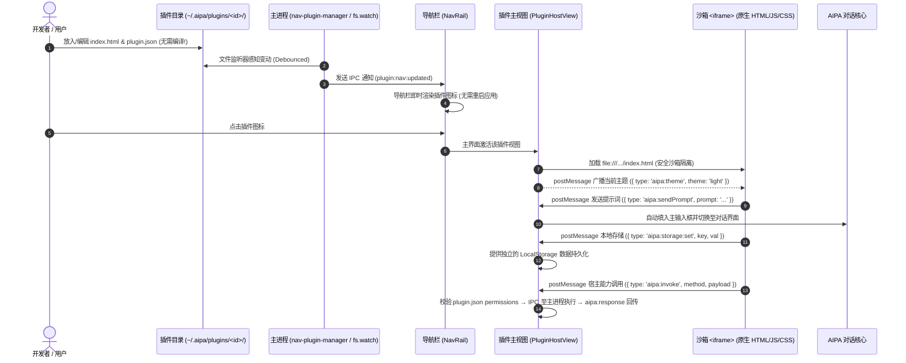
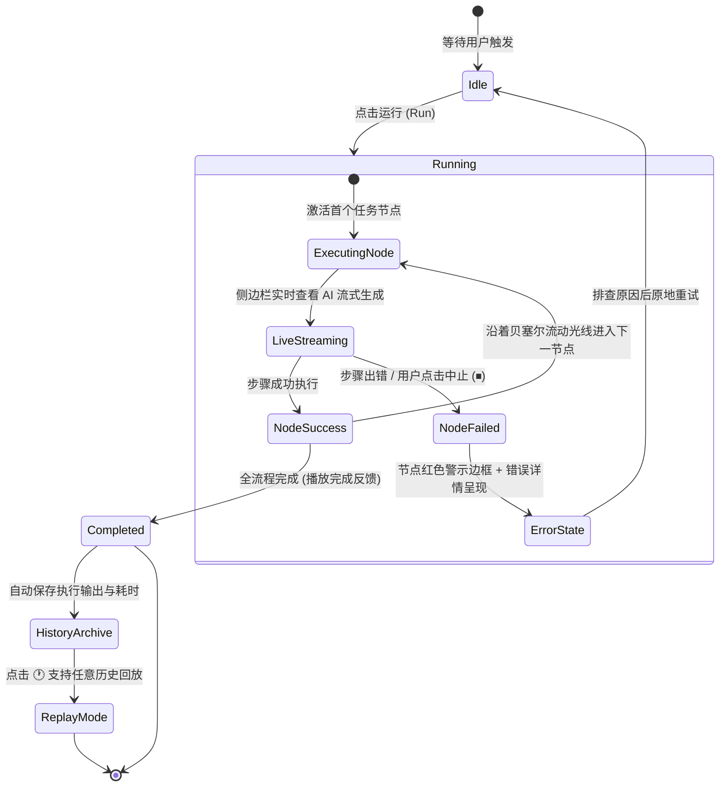
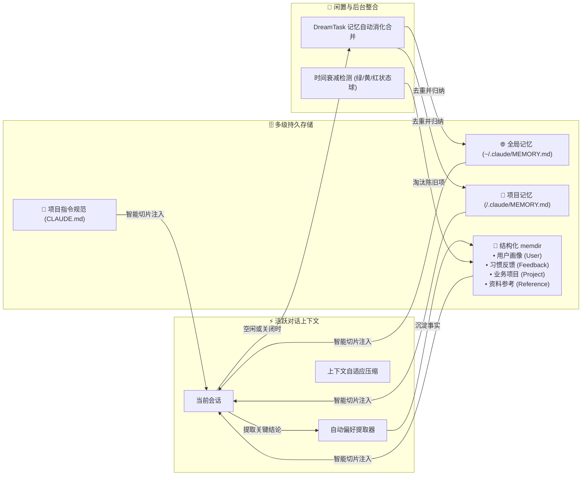

<p align="center">
  <h1 align="center">AIPA</h1>
  <p align="center">
    <strong>AI 个人助手 — 你的全天候桌面智能驾驶舱</strong><br/>
    随问随答，随需随做，驱动终端与代码，事事搞定。
  </p>
  <p align="center">
    
    
    
    
    
  </p>
</p>

---

AIPA 不是一个简单的网页套壳聊天窗口，而是一个真正驻留在你桌面上的**执行级智能代理**。它能读写本地文件、执行 Shell 终端指令、智能调度工作流、管理自动化任务，并跨会话保留记忆与偏好。

底座原生驱动 **OpenAI Codex CLI** 与 **Claude Code CLI** 作为双核执行引擎，外包一层精心打磨的 Electron + React 驾驶舱，同时无缝兼容 OpenAI、DeepSeek、Ollama 及任意 OpenAI 兼容模型。

> 💡 **CLI 是强劲引擎，AIPA 是直观易用的智能驾驶舱。**

---

## 🏛️ 系统架构总览

```mermaid
graph TB
    subgraph Desktop["🖥️ 用户桌面环境 (Windows 10/11)"]
        subgraph ElectronCockpit["🚀 AIPA 智能驾驶舱 (Electron + React)"]
            subgraph Renderer["渲染层 (React 18 + Vite + Zustand)"]
                NavRail["左侧主导航 (NavRail)"]
                MainView["主界面沉浸视图 (MainView)"]
                ChatPanel["结构化对话 / 工具卡片 / LCS Diff"]
                OrgChart["组织架构 (Org Chart)"]
                EmpGallery["员工形象磁贴网格 (HR)"]
                CanvasWorkflow["画布工作流编辑器 (Canvas Engine)"]
                PluginHost["沙箱插件宿主 (Sandboxed iframe)"]
            end
            
            subgraph Preload["安全隔离层 (Preload / contextBridge)"]
                API["window.electronAPI (IPC 强类型通信)"]
            end
            
            subgraph MainProcess["主进程 (Node.js CJS)"]
                PtyMgr["PTY 管理器 (node-pty ConPTY)"]
                CodexBridge["Codex 桥接器 (JSON-RPC 2.0 stdio)"]
                StreamBridge["Claude 桥接器 (NDJSON Stream)"]
                NavPluginMgr["插件热插拔监听 (fs.watch)"]
                ConfigMgr["安全配置管理 (DPAPI 加密)"]
                ClawdPet["桌面宠物集成 (Clawd Win32)"]
            end
        end

        subgraph Engines["⚡ 执行引擎与模型服务"]
            CodexCLI["OpenAI Codex CLI (Rust 原生内核 · 主引擎)"]
            ClaudeCLI["Claude Code CLI (备用引擎)"]
            LLMProviders["多模型接入 (OpenAI / Claude / DeepSeek / Ollama / 千问)"]
        end

        subgraph LocalEnv["💻 本地操作系统能力"]
            Shell["终端执行 (PowerShell / Git Bash / CMD)"]
            FS["本地工作区文件系统 (原子读写 / 差异比对)"]
            Git["Git 版本控制 / Worktree 工作区隔离"]
            MemoryStore["持久记忆存储 (~/.claude/projects / memdir)"]
        end
    end

    Renderer -->|postMessage / IPC| Preload
    Preload -->|IPC Channel| MainProcess
    MainProcess -->|JSON-RPC 2.0 stdio| CodexCLI
    MainProcess -->|NDJSON stdio| ClaudeCLI
    MainProcess -->|HTTP / SSE| LLMProviders
    CodexCLI --> Shell & FS & Git
    ClaudeCLI --> Shell & FS & Git & MemoryStore
```



---

## 🖥️ 桌面交互空间布局

AIPA 采用现代**双栏无缝驾驶舱布局**，去除了繁琐的中间列表栏，使所有核心业务视图均可在主界面中以全屏沉浸模式操作：

```text
┌────────────────────────────────────────────────────────────────────────────────────────┐
│  AIPA — 桌面智能代理驾驶舱                                                      ─  □  ✕  │
├──────┬─────────────────────────────────────────────────────────────────────────────────┤
│ [🏢] │ 组织架构 / 公司模拟图 → 下钻部门名册                                            │
│ 部门 │ ┌─────────────────────────────────────────────────────────────────────────────┐ │
│      │ │ 🤖 Assistant                                                                │ │
│ [👥] │ │ 正在为项目重构文件结构...                                                   │ │
│人事部│ │ ┌─ 🛠️ Tool: Write (src/main/plugins/nav-plugin-manager.ts) ───────────────┐ │ │
│ [📁] │ │ │ + export interface NavPluginManifest { ... }                           │ │  │
│档案部│ │ └────────────────────────────────────────────────────────────────────────┘ │  │
│      │ └─────────────────────────────────────────────────────────────────────────────┘ │
│      │                                                                                 │
│      │ ┌─ 员工形象中心 (HR) ─────────────────────────────────────────────────────────┐ │
│      │ │  ┌─────────┐   ┌─────────┐   ┌─────────┐   ┌─────────┐   ┌─────────┐        │ │
│      │ │  │ 👨‍💻 导师  │   │ 👩‍🔬 分析  │   │ 🎨 创意  │   │ 📚 助教  │   │ ⚡ 效能  │        │ │
│ [📅] │ │  │ Writing │   │ Research│   │ Creative│   │  Tutor  │   │Productiv│        │ │
│ 日历 │ │  └─────────┘   └─────────┘   └─────────┘   └─────────┘   └─────────┘        │ │
│      │ └─────────────────────────────────────────────────────────────────────────────┘ │
│ ───  │                                                                                 │
│ [📝] │ ┌─ Canvas 工作流画布 ─────────────────────────────────────────────────────────┐ │
│ 笔记 │ │  [Node: 读取需求] ──(流动边线)──> [Node: 代码审查] ──(完成)──> [Node: 生成报告]  │ │
│ [🔌] │ └─────────────────────────────────────────────────────────────────────────────┘ │
│ 插件 │                                                                                 │
│ [⚙️]  │ 状态栏: ● 就绪 | 思考深度: 中 | 权限模式: Accept Edits | 消费: $0.04           [🐱 桌宠]│
└──────┴─────────────────────────────────────────────────────────────────────────────────┘
```

---

## 🌟 核心能力矩阵

| 模块 | 核心特性 | 呈现与交互形态 |
|---|---|---|
| **💬 智能对话与执行** | Stream-JSON 极速流式传输、双模型切换、思考链折叠展开、上下文自动压缩与时间差清理 | 结构化工具调用卡片、LCS 增量 Diff 视图、待办任务进度条、执行审批对话框 |
| **👥 人事部 (HR)** | 角色拟人化形象、职业特征定制、发型/服饰/表情自适应、在线状态光圈 | 员工页由「专家」「技能」「工作流」三块统一卡片网格组成（原独立技能面板已并入）：技能卡片一键把斜杠命令投喂到对话、点击查看 SKILL.md 全文，专家卡片可编辑/招募，工作流卡片显示步骤数/运行次数并可一键运行；末尾虚线卡片直接新建，下方为推荐预设 |
| **🏢 组织架构 (Org Chart)** | 部门级「公司模拟图」、主干→母线→支线连接线、随容器宽度与部门数量自适应排版（单行居中 / 多行左侧主干机架式）、部门色标与稳定表情图标；**公司 → 部门 → 团队**三层，套用公司模板即成一节，卡片下可挂团队条（含母线/下垂线的真实子图）与「待上岗」岗位角标 | 只显示部门卡片（不展开员工），点击卡片下钻进入该部门员工名册；卡片悬停可「招募」新员工、打开部门统计弹窗与导出员工列表；下钻后的员工名册以**小黄人人像**展示（单眼/双眼、高矮、发型、嘴巴按会话 ID 稳定生成，常驻呼吸动画，正在回复的人像光环旋转、右手敲键盘），虚化的「待上岗」人像站成独立一区，点一下才真正上岗 |
| **📁 档案部 (Archive)** | 全公司任务总账：以会话为粒度自动归集到**公司/部门/团队**，实时推导不新增存储层、组织/时间/归档状态/全文四维筛选、按公司分组并附未分派收容 | 左侧导航「档案部」或 `Ctrl+8` 进入；每行显示任务标题、所属部门·团队、员工短哈希、时间与轮数，点击直接回到那次会话；行内可标记归档，可导出 `aipa_archive_<date>.json` |
| **🎨 Canvas 工作流** | 多步提示词流水线编排、节点连线拓扑图、实时流式输出预览、历史运行记录回放 | 无限缩放点阵画布、流向贝塞尔曲线动画、错误感知红框、双击原地重命名 |
| **🔌 免编译热插拔插件** | 纯 HTML5+CSS+JS 架构、沙箱安全隔离、双向 postMessage SDK、目录实时监听、AI 编辑抽屉 | 侧边栏动态图标注册、免构建即改即生效、主界面独立宿主、系统工具栏（刷新 / 内置源码预览：文件树 + 行号查看，可一键复制或跳转目录 / **AI 编辑**：右侧抽屉里直接对话让 AI 改插件，改完自动重载） |
| **🧩 插件中心 (Plugin Hub)** | 集中展示、一键激活、查看源码、快速开发指引与插件目录管理 | 预置在左侧栏底部，支持跨插件跳转通信与目录直达；界面与插件名跟随应用语言（中/英） |
| **📝 便签笔记插件 (Notes)** | 模块化热插拔插件架构、Markdown 即写即看、多分类归档、置顶、一键联动 AI 对话 | 独立免编译 HTML 微应用、左侧栏上方快速唤出、Ctrl+3 / Ctrl+Shift+N 快捷绑定、中英双语 |
| **📅 工作日历插件 (Work Calendar)** | 月历跨天任务条、拖动创建任务、AI 流式生成周报/月报、GitHub 与本地文件夹工作源、人天周/月统计 | 周列报告状态徽标一键生成、报告预览/重新生成/一键拉取、数据本地文件持久化与 JSON 导入导出 |
| **🧠 记忆与指令体系** | 全局记忆、项目记忆 (`.claude/MEMORY.md`)、结构化条目 (User/Feedback/Project/Ref) | 四 Tab 记忆工作台（位于「设置 → 记忆」，`Ctrl+5` 直达）、DreamTask 自动整合感知、记忆新鲜度衰减圆点；Codex 引擎下仅「个人」记忆会随消息注入 |
| **🐱 Clawd 桌面宠物** | 原生 Win32 桌宠联动，感知 AI 思考、工具调用与空闲发呆等真实状态 | 任务栏图标智能合并、随身动效、轻量无遮挡 |
| **⚙️ 设置与通道生态** | MCP 工具服务器、OpenClaw/外部消息通道、模型密钥、权限规则集中管控 | 整合至设置中心（Settings → 插件与 MCP / 通道），插件与 MCP 服务器同页管理，AI 引擎页把提供商配置提到 **Model 上方**（在「API 密钥池 / 添加密钥」下方）——密钥在这里添加，已配置的全部密钥也在这里列表展示，选完密钥再往下选模型，精简导航专注核心生产力；MCP 配置按引擎落盘——Codex 引擎写入 `~/.codex/config.toml` 的 `[mcp_servers.*]` 表并回填到 `systemInit`，Claude 引擎仍用 `~/.claude/settings.json`；原 Hooks 配置页已移除（钩子仅由 Claude CLI 读取 `~/.claude/settings.json`，Codex 引擎完全不生效）；原「沙箱」设置页与一批写入被白名单静默忽略的输入框（API Key Helper、输出风格、可用模型、文件建议、状态栏、默认 Shell、忽略 .gitignore、提交署名、Worktree 等）一并移除，设置项只保留真正落盘生效的部分 |

---

## 🔌 免编译热插拔插件系统

AIPA 拥有极简、高可用的**免编译插件体系**。无需配置 Node.js、Vite、Webpack 等繁琐的构建链，使用任何文本编辑器编写原生 HTML/JS/CSS，保存即可实时生效：



### 宿主能力（`aipa:invoke`）
插件在 `plugin.json` 的 `permissions` 中声明所需能力后，即可通过 `postMessage({ type: 'aipa:invoke', requestId, method, payload })` 调用主进程能力，结果以 `{ type: 'aipa:response', requestId, ok, result | error }` 返回。宿主（PluginHostView）与主进程会双重校验权限。

| method | 权限 | 说明 |
|---|---|---|
| `data.get` / `data.set` | `storage` | 文件持久化，写入 `~/.aipa/plugin-data/<pluginId>/<key>.json`（原子写） |
| `github.commits` | `network` | 主进程调用 GitHub commits API（支持分支/作者过滤/Token，20 秒超时） |
| `fs.pickFolder` / `fs.scanFolder` | `fs` | 原生目录选择；按修改时间与 `*.ext` 过滤扫描文件变更（跳过 node_modules/.git 等） |
| `ai.generate` / `ai.abort` | `ai` | 以 ephemeral 方式生成一次文本，经 `aipa:ai:event`（delta/status/done/error）流式回传。按对话相同的路由选择引擎：模型属于已启用的网关 / 兼容接口时走该提供商（Claude CLI + 其 base URL 与 token），否则走只读沙箱的 Codex |

随应用发布的多文件插件放在 `electron-ui/src/main/plugins/builtin/<dir>/`，构建时由 `npm run build:plugins` 复制到 `dist`，启动时自动安装到 `~/.aipa/plugins/`；仅当内置版本号更高时才覆盖升级，插件数据保存在 `plugin-data` 中不受升级影响。

### 🤖 AI 编辑抽屉（`plugin:edit:*`）

插件宿主工具栏的「Source」右侧是**「编辑」**：点开后从右侧滑出一个 AI 对话抽屉，用自然语言描述要改什么，AI 直接就地改写插件的文件。

它不需要任何新的编辑机制——插件本来就是磁盘上一堆 HTML/CSS/JS，所以「和 AI 聊着改插件」就是**一次以插件文件夹为工作目录的普通多轮对话**：

```text
┌─ 插件主机 (PluginHostView) ─────────────────────────────┬─ AI 编辑抽屉 ──────────┐
│  [⟳ 刷新] [</> Source] [✨ 编辑] [✕]                     │  ✨ AI 编辑插件  [📂][✕]│
│                                                          │  ┌──────────────────┐  │
│   (插件 iframe 仍在运行，改完自动重载)                   │  │ 把顶部栏改成深色 │  │
│                                                          │  └──────────────────┘  │
│                                                          │  🔧 read  index.html   │
│                                                          │  🔧 apply_patch …      │
│                                                          │  已改好 index.html 的  │
│                                                          │  顶部栏配色。          │
│                                                          │  ┌──────────────────┐  │
│                                                          │  │ Enter 发送 …     │  │
│                                                          └───────────────────────┘
```

- **工作目录 = 插件目录**：主进程为每个插件起一个 Codex 会话（`cwd` 即 `plugin.dirPath`，由主进程自己从插件列表解析，不接受渲染进程传路径），AI 因此能读写该插件自己的文件；给它的常驻指令限定「只改这个插件文件夹、不要动 plugin.json 的 id、改完用一两句话说明」。
- **实时可见**：`turn` 里每一次工具调用（读文件 / 改文件）都通过 `plugin:edit:event` 流式推到抽屉里显示成一行「🔧 工具名 + 文件名」，回答正文同样流式显示。
- **改完即生效**：一轮结束后抽屉回调宿主刷新 iframe，插件立刻以新代码重新加载，无需手动点刷新。
- **不遮挡插件**：抽屉是插件容器的**并排兄弟节点**而不是浮层——打开后 iframe 被挤压到剩余宽度，插件始终完整可见，改的时候可以同时盯着插件本身。
- **多轮 + 可中断**：抽屉内可连续追问（同一会话保持上下文）；生成中「停止」按钮走 `plugin:edit:abort`，关闭抽屉则整个会话结束。会话是 ephemeral 的，**不会**出现在会话历史里。
- **四条通道**：`plugin:edit:start`（首条消息，开会话）/ `plugin:edit:send`（追问）/ `plugin:edit:abort` / `plugin:edit:close`，事件统一走 `plugin:edit:event`（`delta` / `tool` / `status` / `done` / `error`）。与 `ai.generate` 不同，这是**宿主**在用户授意下改插件，因此不再要求插件自己声明 `ai` 权限——与源码预览同级的信任模型。

### 插件目录规范
每个插件只需一个普通文件夹，存放在 `~/.aipa/plugins/<id>/`：
```text
~/.aipa/plugins/
├── welcome/               # 🧩 插件中心 (系统预置，浏览/管理插件生态)
│   ├── plugin.json
│   └── index.html
├── notes/                 # 📝 便签笔记 (官方热插拔插件，Markdown + AI 对话联动)
│   ├── plugin.json
│   └── index.html
├── work-calendar/         # 📅 工作日历 (官方预置，任务日历 + AI 周报/月报 + 工作源 + 人天)
│   ├── plugin.json
│   ├── index.html
│   ├── style.css
│   └── js/                # bridge / store / generation / views/*
└── <custom-plugin>/       # 🛠️ 你的专属微工具 (免编译即写即用)
    ├── plugin.json        # 插件清单（name / nameEn、图标；统一显示在左侧栏上方）
    ├── index.html         # 界面主入口（纯 HTML5）
    ├── style.css          # 样式文件（可直接使用宿主 CSS 变量）
    └── app.js             # 业务逻辑（通过 window.postMessage 与宿主通信）
```

### 🧩 官方预置插件示例

三个预置插件都放在 `src/main/plugins/builtin/`，版本号更新时会自动升级到 `~/.aipa/plugins`。宿主以 `?lang=en|zh-CN` 把当前界面语言传给插件，插件据此显示中文或英文；左侧栏与插件标题栏在英文下使用 `nameEn`。

1. **插件中心 (Plugin Hub)**：提供全局已安装插件仪表盘、一键进入/直达各插件视图、直接打开源码文件夹或在内置源码预览中按文件树查看（带行号、可一键复制），以及极简 3 步开发者扩展指引。
2. **便签笔记 (Quick Notes)**：从原有固定组件解耦为标准免编译插件，具备双栏编辑/预览、分类标签过滤（工作/灵感/学习/提示词/待办）、卡片置顶、以及「🤖 发送给 AI」一键联动主对话框深度分析。
3. **工作日历 (Work Calendar)**：由原飞书 aPaaS 全栈应用（NestJS + PostgreSQL + React）迁移而来，改为纯前端插件 + 宿主能力：
   - **日历**：周一对齐月视图，跨天任务条按 lane 布局；点击日期或按住拖动创建任务，点任务条编辑/删除；底部为当日任务面板。
   - **AI 周报/月报**：周列时钟图标一键生成该周周报（素材 = 周期内任务 + 绑定工作源的提交/文件变更），左上角图标由本月周报合并生成月报；流式预览，完成后自动保存；预览弹窗支持「一键拉取」「重新生成」（覆盖原报告）、复制与发送到对话继续润色。
   - **工作源**：GitHub 仓库（owner/repo 或仓库地址、分支、作者过滤、Token）与本地文件夹（原生选择目录、文件过滤），可拉取本周并查看结果；删除工作源会自动解绑任务。
   - **提醒**：原左侧栏「任务」面板的提醒功能迁入此处，支持 N 分钟后、指定时间与 cron 周期提醒；由主进程后台调度，插件未打开也会弹出系统通知，点击通知直达工作日历。原「任务」面板已移除，旧待办与提醒在首次启动时自动导入工作日历，`Ctrl+7` 现在打开工作日历。
   - **任务 / 报告 / 人天**：任务统计卡、筛选、行内改状态；历史报告查看/编辑/导出 .md；人天周视图增删改与「从任务自动生成」（5 个工作日按 0.5 步进均摊），月视图按周聚合。
   - **设置**：生成模型、周报/月报提示词模板（`{{period}}` / `{{material}}`），数据 JSON 导入导出（不含 Token）。生成按对话相同的路由走：模型属于已启用的网关 / 兼容接口时用该提供商的凭据，否则用 Codex；两者都不可用时会立即提示，而不是无限重试。

---

## 🏢 组织架构 (Org Chart)

部门页是一张**公司模拟图**：顶部是公司总部节点，主干线向下落入横向母线，再由支线分别连到各个部门卡片。这一层**不铺开各部门的员工（会话）**，让「公司由哪些部门组成」一眼可见；把层级开关切到「部门 + 团队」，每张卡片下方还会长出它的团队。

部门较少时（单行、整体居中，主干从正中下引）：

```text
                        ┌──────────────────────────┐
                        │       🏢  AIPA 公司       │
                        │    3 个部门 · 14 名员工    │
                        └────────────┬─────────────┘
                                     │  主干 (trunk)
              ┌──────────────────────┴──────────────────────┐  ← 母线 (bus)
              │                                             │
        ┌─────┴─────┐                                 ┌─────┴─────┐
        │ 🧪 研发中心│                                 │ 🎨 设计工作室│
        │ D:/projects│                                │ D:/design  │
        │ 👥 11  💬 3122│                              │ 👥 3  💬 2017│
        └───────────┘                                 └───────────┘
```

部门变多时自动切换为**机架式**排版（主干靠左贯穿所有行，每行拉出一条母线，再由支线落入各卡片中心）：

```text
  ┌─────────────┐
  │   公司 HQ   │
  └──────┬──────┘
         │
         ├─────────┬──────────────┬──────────────┬
                   │              │              │
              ┌─────────┐  ┌─────────────┐  ┌─────────┐
              │研发中心 │  │ 设计工作室  │  │ 市场部  │
              └─────────┘  └─────────────┘  └─────────┘
         │
         ├─────────┬──────────────┬
                   │              │
              ┌─────────┐  ┌─────────────┐
              │ 财务部  │  │   法务部    │
              └─────────┘  └─────────────┘
```

再往下一层，是部门自己的团队（层级开关「部门 + 团队」）：

```text
                        ┌───────────────────┐
                        │      🚀 研发部     │
                        │  👥 5  💬 100  🎯 2│  ← 🎯 = 待上岗岗位
                        └─────────┬─────────┘
                                  │  主干
                        ┌─────────┴─────────┐  ← 母线
                        │                   │
                   ┌────┴────┐         ┌────┴────┐
                   │🔗前端组  │         │🔗后端组  │
                   │3 · 待上岗 1│       │2 · 待上岗 1│
                   └─────────┘         └─────────┘
```

- **自适应排版**：列数由容器宽度与部门数量共同决定——单行最多 4 张，部门达到 9 个进入紧凑模式（最多 5 张、卡片同步收紧）；部门较少时整行居中、主干从正中下引，部门增多时自动切换为「左侧主干 + 每行一条母线」的机架式布局
- **每家公司自成一节**：套用几套公司模板就有几节，各带自己的总部卡片；总部显示的是**真实公司名**（软件公司 / 内容工作室…），汇总口径也只算这一节（部门数、员工数含团队成员、消息数）。老用户的顶层平铺部门落在最后一节，外观与从前完全一致
- **层级开关「部门」/「部门 + 团队」**：默认只画部门（公司由哪些部门组成一目了然）；切到「部门 + 团队」后，每张部门卡片下方长出一条**团队条**——卡片底部中点引下主干，接一条横向母线，再分别垂落到每个团队 chip 的中心。chip 等宽（`(卡片宽 - 间隙) / n`），所以母线不需测量 DOM 就能画准；团队多于 3 个时收成 `+N`，点击进入该部门看全部
- **团队 chip 也是入口**：显示团队名与员工数（有岗位时附带「待上岗 N」），点击直接进入**团队自己的名册页**
- **诚实计数**：卡片统计只算该节点目录下的真实会话（团队各有自己的目录），「待上岗」岗位单独用淡色角标显示，**永不加进员工数**
- **分行自动均衡**：按列数把部门均匀分行，末行不会只剩孤零零 1 张（5 个部门排成 3 + 2，而不是 4 + 1）
- **卡片宽度自动伸缩**：常规 216–400px、紧凑模式 180–300px，窗口缩放时实时重排，不溢出也不留大片空白
- **卡片信息**：部门表情图标（按部门 ID 稳定生成）、部门名、工作目录、员工数与消息数、最近活跃时间，活跃部门带呼吸状态点
- **悬停即操作**：悬停卡片浮现「+ 招募」（直接在该部门新建一名员工/会话）与「进入 ›」
- **点击卡片下钻**：进入该部门的员工名册界面，按 TODAY / YESTERDAY / THIS WEEK 分组展示该部门**全部员工（会话）**，支持搜索、导出与招募
- **「待上岗」分区**：节点上还挂着岗位时，时间分组**之上**先列出这一区——虚化的无脸人像 + 岗位名 + 「待上岗」，宽高与真实员工完全一致，所以上岗时是「一个人走进座位」而不是整排重排。单击即上岗：那段职位描述作为第一条消息发出，真实会话随即出现，幽灵同时消失；岗位也可以直接移除（二次确认）
- **部门页也是团队页**：团队有自己的目录，所以从团队 chip 进来看到的就是团队自己的名册——头部带「研发部 › 团队」面包屑与返回上级，页内还有一条团队栏，不用退回架构图也能横向切换
- **员工名册用「小黄人」人像而非卡片**：名册里每个员工都是一个黄色小人，站成一排同一条地面上（见下方示意）。形象由会话 ID 哈希稳定生成——单眼 / 双眼、高矮、头发（三根翘毛 / 一根呆毛 / 侧分 / 光头）、工装裤配色与嘴巴表情各不相同，所以同一名员工每次回来都还是同一个小人，一个部门看上去就是一群不一样的小黄人
- **常驻呼吸动画**：每个小人常驻轻微呼吸（上下浮动 + 极缓慢眨眼），相位随哈希错开，整排不会同频抖动；某个员工正在生成回复时，他的呼吸加快、右臂开始敲键盘、头顶光环持续旋转，一眼就能看出「谁在干活」
- **人像上的操作**：悬停浮现图钉（本地置顶，与名册卡片一致）；`Shift+点击`循环切换会话色标，色标同时作为脚下的一圈地光；悬停浮现解雇按钮，二次确认（解雇 / 取消）后才会真正删除
- **部门统计弹窗**：卡片右上角图表按钮打开，显示员工数、今日活跃、消息总数、最近活跃与工作目录，并可导出 `<部门名>_employees.json`
- **招募新员工 = 先写职位描述**：点「+ 招募」（或按 `N`）弹出招募弹窗，填写这名员工的**职位描述**——它负责什么、需要什么技能。弹窗里的「✨ AI 润色」按钮会把草稿改写成更清晰的职位描述（流式回填到输入框，可随时「停止」），确认后这段描述直接作为这名员工的**第一条消息**发出去，员工立刻开工；留空则先建一个待命的员工
- **新增部门**：工具栏「+ 新增部门」或按 `N` 键。面板顶部的「从模板创建」可一键套用内置的**公司架构模板**；也可手动填写名称与工作目录，确认后直接下钻进入新部门

下钻后的员工名册长这样——每个人是一个独立的小黄人，站成一排：

```text
   ◯      ◯      ◯          ◯      ◯
  /|\    /|\    /|\        /|\    /|\
  / \    / \    / \        / \    / \
 ──●──────●●─────○──────────●──────●─────  地面 / 色标地光
 单眼秃顶 双眼呆毛 高个子   单眼三根毛 双眼短腿
                       ↑ 正在回复：光环旋转 + 右手敲键盘
```

### 🏗️ 公司架构模板 (Company Templates)

新装的 AIPA 是一张空白的组织架构图，而「从零搭一家公司」要凭空想出十几个名字、十几个文件夹和一整套层级。内置模板把这件事变成一次点击：**选公司类型 → 选根目录 → 一键建成**。

```text
┌─ 🏗️ 从一家公司开始 ─────────────────────────────────────────────────┐
│  ┌──────────────┐ ┌──────────────┐                                  │
│  │ </> 软件公司 │ │ ✍️ 内容工作室 │  ← 四种公司类型，各覆盖全职能     │
│  └──────────────┘ └──────────────┘                                  │
│  ┌──────────────┐ ┌──────────────┐                                  │
│  │ 🛒 电商公司  │ │ ⚗️ 学术研究团队│                                 │
│  └──────────────┘ └──────────────┘                                  │
│  ┌──────────────────────┐ ┌──────────────────────┐                  │
│  │📂 沿用我现有的工作目录│ │⬚ 空白开始            │                 │
│  └──────────────────────┘ └──────────────────────┘                  │
│                                                                     │
│ 即将创建                                                            │
│  ● 软件公司                                                         │
│    ● 产品部 2 个待上岗                                              │
│    ● 设计部 1 个待上岗                                              │
│      └ 设计系统组 1 个待上岗                                        │
│    ● 研发部 1 个待上岗                                              │
│    …                                                                │
│ 将创建 9 个部门 · 3 个团队 · 13 个待上岗岗位                        │
│                                                                     │
│ 根目录  [ C:/Users/me/AIPA               ] [ 选择文件夹 ]           │
│        公司文件夹会建在这个根目录下                                 │
│        例如「AIPA/软件公司/研发部/后端组」                          │
│                                                                     │
│                       [ 取消 ]  [ 创建 12 个节点 ]                  │
└─────────────────────────────────────────────────────────────────────┘
```

- **四种公司类型**：软件公司、内容工作室、电商公司、学术研究团队——每个都**覆盖一家公司真正需要的全部职能**。软件公司一次就建出产品、设计、研发、测试、运维、数据、安全、客户成功、市场九个部门，而不是某个领域里的几个部门
- **公司 → 部门 → 团队，三层一次建好**：团队就是子文件夹（`~/AIPA/软件公司/研发部/后端组/`），和部门一样拥有自己的员工与会话
- **岗位先挂着，点一下才上岗**：模板同时写入每个节点的岗位名与职位描述，名册里显示虚化的「待上岗」员工。**套用模板全程零模型调用**——只有点「上岗」时才真正创建会话，那段职位描述就是这位员工的第一条消息
- **真实建文件夹**：确认后按父先子后的顺序逐个建目录（默认根目录 `~/AIPA`），建好即可招募
- **重复套用是幂等的**：已经存在的节点会被跳过并如实扣除（预览里灰掉），一个不剩时主按钮变为「已全部存在」并置灰
- **可以再套第二个模板**：第二家公司落在同一根目录下的另一个文件夹，组织架构图渲染成上下两节，第一家公司完全不受影响
- **沿用我现有的工作目录**：把历史会话用过的工作目录一次性变成部门（这项能力以前是静默自动发生的，现在改为用户显式选择）
- **空白开始**：想自己搭就选它，之后不会再被弹窗打扰
- **三个入口共用同一个弹窗**：组织架构空状态、组织架构的「新增部门」面板、侧栏的新增部门表单，都从这里进入

---

## 👥 人事部 (HR)

「人事部」不挂在任何部门之下——它横向看**全公司的人**：三个并列的卡片网格，分别是专家、技能与工作流。公司里管「所有员工」的是人事部；具体某个部门有哪几名员工，则从组织架构图下钻去看。

```text
┌──────────────────────────────────────────────────────────────────────┐
│ 👥 人事部                                                            │
│ 管理公司全体员工：专家是可随时切换岗位的专职员工，技能是他们随身携带 │
│ 的提示词包，工作流把多步任务串成可复用的流水线。                     │
├──────────────────────────────────────────────────────────────────────┤
│ 🧑💼 专家                                            [ + 招募专家 ]  │
│  每位专家擅长一个领域，拥有独立的专长、提示词与模型。点击卡片编辑。  │
│  ┌────────┐ ┌────────┐ ┌────────┐ ┌────────┐                         │
│  │ 编码导师│ │ 写作教练│ │ 数据分析│ │ 产品参谋│ ← 点即切换当前岗位  │
│  └────────┘ └────────┘ └────────┘ └────────┘                         │
│                                                                      │
│ 🧰 技能                                             [ + 新建技能 ]   │
│  可复用的提示词包（SKILL.md），在对话中用斜杠命令调用。点击查看内容。│
│  ┌────────┐ ┌────────┐ ┌────────┐                                    │
│  │ 代码审查│ │ 周报生成│ │ 文档翻译│                                 │
│  └────────┘ └────────┘ └────────┘                                    │
│                                                                      │
│ 🔀 工作流                                         [ + 新建工作流 ]   │
│  把多个提示词串联成流水线，运行后按顺序加入任务队列执行。            │
│  ┌────────────────┐ ┌────────────────┐                               │
│  │ 每周周报流水线 │ │ 代码评审流水线 │  ← 单 Agent / 多 Agent 协作   │
│  └────────────────┘ └────────────────┘                               │
└──────────────────────────────────────────────────────────────────────┘
```

- **专家 = 可随时切换岗位的专职员工**：每位专家带一套自己的专长、提示词与模型，点一下就把当前对话切到该岗位；卡片带主题色底衬与职业徽标，一眼分辨岗位
- **技能 = 员工随身携带的提示词包**：以 `SKILL.md` 存在，在对话里用斜杠命令调用；点开卡片可查看完整内容，连点两次确认后删除
- **工作流 = 把多步任务串成可复用的流水线**：分单 Agent（`singleAgent`）与多 Agent 协作（`teamwork`）两类，可按最近更新 / 名称 / 运行次数排序，也可从剪贴板粘贴 JSON 导入
- **一键抵达**：左侧导航点「人事部」，或在命令面板搜「人事部」

## 📁 档案部 (Archive)

档案部是**覆盖全公司的任务总账**：一个员工就是一次会话，所以每一行就是一次会话记录，归属关系由「会话所在目录 → 组织节点」实时推导——优先用引擎给出的真实工作目录（Codex），没有时退回 `dirToSlug(节点目录) === 会话 projectSlug`（Claude 的项目目录名本身就是这个 slug）。不额外存一份归属字段，改部门目录也不会留下脏数据。哪个项目、分派给了哪个部门、由哪名员工做的、什么时候做的、聊了多少轮，在这里一次看全。

```text
┌────────────────────────────────────────────────────────────────────────┐
│ 📁 档案部         共 47 项任务 · 2 个组织 · 本周 12 项        [ 导出 ]  │
├────────────────────────────────────────────────────────────────────────┤
│ [ 全部组织 ▾ ]  [全部] [今天] [本周] [本月]  [显示已归档]  🔍 搜索…    │
├────────────────────────────────────────────────────────────────────────┤
│ 🏢 软件公司                                                  14 项     │
│   重构 pty-manager 重连逻辑   研发部 · 后端组 #a3f21c 今天 14:02  18 轮│
│   补齐 app-server 协议文档    研发部          #7d0e55 昨天 20:11   6 轮│
│   暗色玻璃质感重做            设计部 · 设计系统组 #c91b02 本周二 24 轮│
│ 🏢 内容工作室                                                 3 项     │
│   选题会的十条备选角度       选题策划部      #9911ab 本周一 11:40  9 轮│
│ 📁 未分派                                                     2 项     │
│   随手问的几条问题            D:/scratch     #4188aa 今天 09:12   2 轮│
└────────────────────────────────────────────────────────────────────────┘
```

- **实时推导，不新增存储**：部门与会话靠 `sessionMatchesDir(session, 节点目录, homeDir)` 连接（优先真实 `cwd`，退回 slug 比较），部门表仍然只存在本地，档案不会变成第二份真相
- **按公司（根节点）分组**：一行只显示任务、员工与时间，归属用「研发部 · 后端组」这样的小标签标在标题后面；同一家公司下的部门与团队归在同一个抬头里，不会碎成三组互相看不见。「未分派」永远排在最后，收纳那些不在任何节点目录下产生的会话，而不是把它们丢掉
- **四维筛选**：组织（全部 / 各家公司 / 未分派）、时间（全部 / 今天 / 本周 / 本月）、是否显示已归档、以及标题与首条提示词的搜索
- **点一行回到那次会话**：直接载入该会话历史并切到聊天面板；从档案部进入不会显示「返回部门」按钮（那个按钮的落点是部门视图，会把人带到一个从未去过的地方）
- **归档与导出**：行内可把某条任务标记为已归档（默认隐藏，可随时筛出来）；导出为 `aipa_archive_<日期>.json`，按公司分组并逐条附上所属部门/团队，含任务标题、员工、会话 ID、工作目录、轮数与时间
- **入口**：左侧导航「档案部」、命令面板搜「档案部」，或按 `Ctrl+8`

---

## 🎨 Canvas 工作流引擎

可视化工作流画布支持将复杂的多步 AI 任务连接为自动化执行流：



- **无限画布体验**：支持拖拽平移、滚轮缩放、节点折叠/展开、框选与双击原地修改标题。
- **坐标持久化**：自定义排布坐标即时保存至 `canvasPos`，重开页面保持完美布局。

---

## 🧠 分层记忆与自主整合

AIPA 拥有类似人类记忆的层次化沉淀机制，有效防止多轮对话后的上下文遗忘：



---

## ⌨️ 效率快捷键速查

| 快捷键 | 功能描述 | 快捷键 | 功能描述 |
|---|---|---|---|
| `Ctrl+N` | 新建对话 | `Ctrl+Shift+P` | 唤起全局命令面板 |
| `Ctrl+K` | 会话快速切换器（模糊搜索） | `Ctrl+F` | 检索当前会话内容 |
| `Ctrl+Shift+F` | 全局跨会话文件搜索 | `Ctrl+Shift+R` | 重新生成回复（可换模型） |
| `Ctrl+Shift+K` | 立即压缩上下文 (/compact) | `Ctrl+Shift+O` | 切换沉浸专注模式 |
| `Ctrl+Shift+D` | 切换深色 / 浅色 / 系统主题 | `Ctrl+Shift+L` | 切换界面语言（中/英） |
| `Ctrl+Shift+T` | 窗口置顶（保持最前） | `Ctrl+,` | 打开系统设置面板 |
| `Ctrl+1 ~ 8` | 主界面视图快速切换（`Ctrl+8` = 档案部） | `Ctrl+/` | 快捷键速查帮助弹窗 |
| `Ctrl+Shift+Space` | **全局唤醒 / 隐藏 AIPA** | `Ctrl+Shift+G` | **全局读取剪贴板并提问** |

---

## 🚀 快速启动

### 1. 克隆与安装
```bash
git clone https://github.com/CipherSlinger/AIPA.git
cd AIPA/electron-ui
npm install
```

### 2. 编译并启动
```bash
# 一键编译所有目标（Main、Preload、Renderer）
npm run build

# 启动桌面应用程序
node_modules/.bin/electron dist/main/index.js
```

### 3. 开发热更新模式
```bash
# 终端 1：启动 Vite 开发服务
npm run build:main && npm run build:preload && npm run dev:renderer

# 终端 2：以开发模式载入 Electron
NODE_ENV=development node_modules/.bin/electron dist/main/index.js
```

### 4. 构建 Windows 安装包
```bash
npm run dist:win   # 产物生成在 release/ 目录下
```

---

## 🛡️ 安全与沙箱机制

- **凭证安全**：API Key 采用操作系统级密钥链（`electron.safeStorage` / Windows DPAPI）加密存储。
- **环境隔离**：第三方插件在受限的 Sandboxed `<iframe>` 中运行，严禁直接访问 Node.js 原生 API。
- **权限可控**：提供 5 级工具权限控制（Default / Accept Edits / Don't Ask / Plan Only / Bypass），破坏性操作弹出直观卡片审核。
- **执行安全**：子进程采用精简环境变量白名单，杜绝敏感密钥意外泄露。

---

## 📄 开源许可证

本项目基于 [MIT 许可证](LICENSE) 分发。
