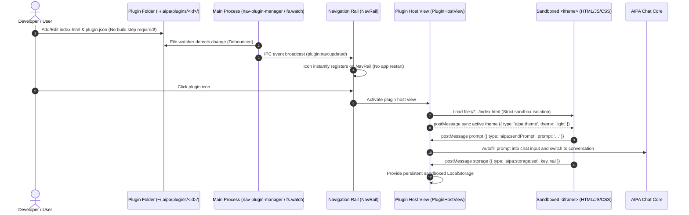
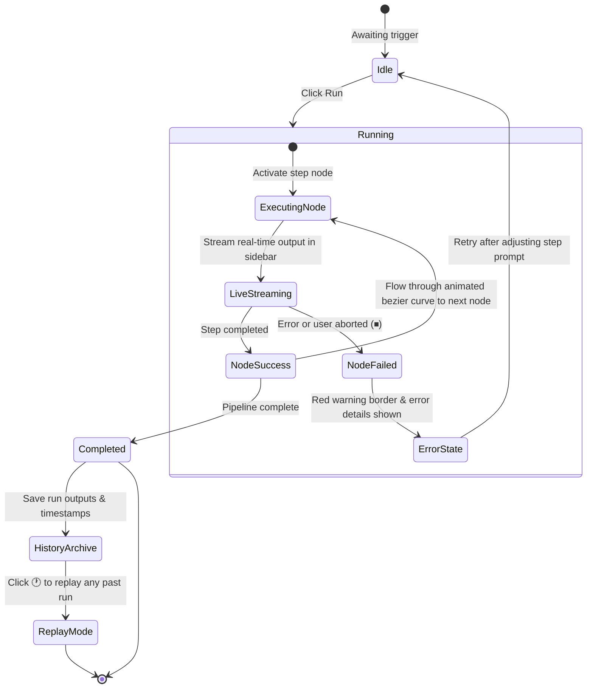
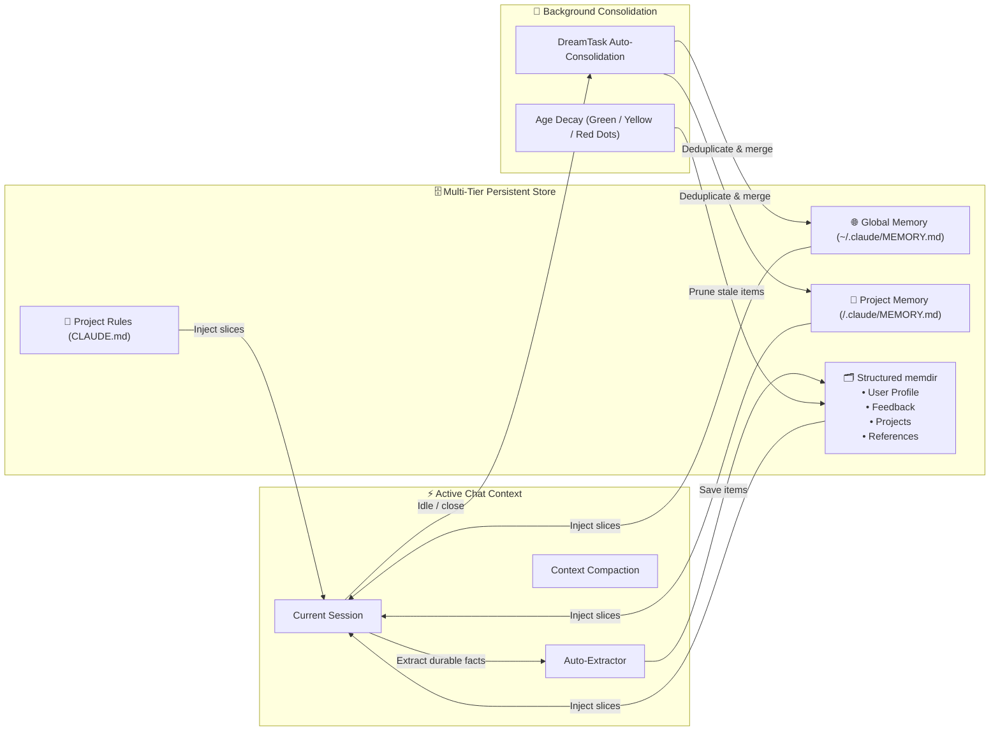

<p align="center">
  <h1 align="center">AIPA</h1>
  <p align="center">
    <strong>AI Personal Assistant — Your Always-On Desktop Agent Cockpit</strong><br/>
    Ask anything. Automate anything. Drive terminal and code, get things done.
  </p>
  <p align="center">
    
    
    
    
    
  </p>
</p>

---

AIPA is not a simple web-wrapper chat window. It is an **action-oriented desktop agent** that lives alongside you — reading and writing local files, executing shell commands, chaining tasks into automated workflows, and maintaining memory and preferences across sessions.

Under the hood, it drives **OpenAI Codex CLI** and **Claude Code CLI** as dual-core execution engines, packaged inside a finely tuned Electron + React cockpit with native multi-model support for OpenAI, Claude, DeepSeek, Ollama, and any OpenAI-compatible provider.

> 💡 **The CLI is the high-performance engine; AIPA is your intuitive cockpit.**

---

## 🏛️ System Architecture

```mermaid
graph TB
    subgraph Desktop["🖥️ User Desktop Environment (Windows 10/11)"]
        subgraph ElectronCockpit["🚀 AIPA Desktop Cockpit (Electron + React)"]
            subgraph Renderer["Renderer Layer (React 18 + Vite + Zustand)"]
                NavRail["Navigation Rail (NavRail)"]
                MainView["Main Content View (MainView)"]
                ChatPanel["Structured Chat / Tool Cards / LCS Diff"]
                OrgChart["Organization Chart"]
                EmpGallery["HR (People Ops)"]
                CanvasWorkflow["Canvas Workflow Editor"]
                PluginHost["Sandboxed Plugin Host"]
            end
            
            subgraph Preload["Isolation Layer (Preload / contextBridge)"]
                API["window.electronAPI (Type-safe IPC Bridge)"]
            end
            
            subgraph MainProcess["Main Process (Node.js CJS)"]
                PtyMgr["PTY Manager (node-pty ConPTY)"]
                CodexBridge["Codex Bridge (JSON-RPC 2.0 stdio)"]
                StreamBridge["Claude Bridge (NDJSON Stream)"]
                NavPluginMgr["Hot-Pluggable Plugin Watcher (fs.watch)"]
                ConfigMgr["Secure Config (DPAPI safeStorage)"]
                ClawdPet["Clawd Desktop Pet Integration"]
            end
        end

        subgraph Engines["⚡ Execution Engines & Providers"]
            CodexCLI["OpenAI Codex CLI (Rust Native Core · Primary Engine)"]
            ClaudeCLI["Claude Code CLI (Fallback Engine)"]
            LLMProviders["Multi-LLM Providers (OpenAI / Claude / DeepSeek / Ollama / Qwen)"]
        end

        subgraph LocalEnv["💻 Local Operating System"]
            Shell["Terminal Execution (PowerShell / Git Bash / CMD)"]
            FS["Workspace File System (Atomic Read/Write / Diffs)"]
            Git["Git Version Control / Worktree Isolation"]
            MemoryStore["Persistent Memory (~/.claude/projects / memdir)"]
        end
    end

    Renderer -->|postMessage / IPC| Preload
    Preload -->|IPC Channel| MainProcess
    MainProcess -->|JSON-RPC 2.0 stdio| CodexCLI
    MainProcess -->|NDJSON stdio| ClaudeCLI
    MainProcess -->|HTTP / SSE| LLMProviders
    CodexCLI --> Shell & FS & Git
    ClaudeCLI --> Shell & FS & Git & MemoryStore
```



---

## 🖥️ Desktop Cockpit Layout

AIPA adopts a modern **two-column layout** eliminating redundant intermediate lists. All core features open directly in the full-screen primary workspace:

```text
┌────────────────────────────────────────────────────────────────────────────────────────┐
│  AIPA — Desktop Agent Cockpit                                                    ─  □  ✕  │
├──────┬─────────────────────────────────────────────────────────────────────────────────┤
│ [🏢] │ Org Chart / Company Map → Department Roster                                     │
│ Dept │ ┌─────────────────────────────────────────────────────────────────────────────┐ │
│      │ │ 🤖 Assistant                                                                │ │
│ [👥] │ │ Refactoring module architecture...                                          │ │
│ HR   │ │ ┌─ 🛠️ Tool: Write (src/main/plugins/nav-plugin-manager.ts) ───────────────┐ │ │
│ [📁] │ │ │ + export interface NavPluginManifest { ... }                           │ │  │
│ Arch │ │ └────────────────────────────────────────────────────────────────────────┘ │  │
│      │ └─────────────────────────────────────────────────────────────────────────────┘ │
│      │                                                                                 │
│      │ ┌─ Employee Roster (HR)   ─────────────────────────────────────────────┐ │
│      │ │  ┌─────────┐   ┌─────────┐   ┌─────────┐   ┌─────────┐   ┌─────────┐        │ │
│      │ │  │ 👨‍💻 Coach  │   │ 👩‍🔬 Analyst│   │ 🎨 Creative│   │ 📚 Tutor │   │ ⚡ Productiv│   │ │
│ [📅] │ │  │ Writing │   │ Research│   │ Partner │   │ Academic│   │  Coach  │        │ │
│ Cal. │ │  └─────────┘   └─────────┘   └─────────┘   └─────────┘   └─────────┘        │ │
│      │ └─────────────────────────────────────────────────────────────────────────────┘ │
│ ───  │                                                                                 │
│ [📝] │ ┌─ Canvas Workflow Editor ────────────────────────────────────────────────────┐ │
│Notes │ │  [Node: Read Spec] ──(flowing line)──> [Node: Code Review] ──(done)──> [Done] │ │
│ [🔌] │ └─────────────────────────────────────────────────────────────────────────────┘ │
│Plugin│ ┌─ Interaction Input Area ────────────────────────────────────────────────────┐ │
│ [⚙️]  │ Status: ● Ready | Thinking: Medium | Perm: Accept Edits | Cost: $0.04    [🐱 Clawd]│
└──────┴─────────────────────────────────────────────────────────────────────────────────┘
```

---

## 🌟 Core Capabilities

| Module | Core Features | Visual Presentation |
|---|---|---|
| **💬 Chat & Execution** | Stream-JSON real-time stream, dual-model switching, collapsible thinking chain, auto-compaction | Structured tool cards, LCS color-coded diff view, task checklist, interactive permission dialog |
| **👥 HR (People Ops)** | Character persona illustrations, role-tailored attire/hairstyles, glowing status aura | The HR page shows Experts, Skills and Workflows as matching card grids (the standalone Skills panel was merged in): a skill card feeds its slash command into chat or opens the full SKILL.md, expert cards can be edited or recruited, workflow cards show step and run counts with hover edit/duplicate/delete and one-click run; a dashed card at the end creates a new item, with suggested presets below |
| **🏢 Org Chart** | Company-style department map, trunk→bus→drop connector lines, layout adapts to both container width and department count (centred single row / left-rail multi-row), per-department color and stable emoji; **company → department → team** across three levels, one section per applied template, a team strip always drawn under each card (a real sub-tree with its own bus and drops) and “open position” badges | Shows departments only (employees stay collapsed); clicking a card drills into that department's employee roster, and hovering offers direct recruit, a stats popover, employee export, or **deleting the department** (a confirm box outside the card giving the team count that will cascade with it, and keeping the folder and its sessions on disk). The roster itself renders each employee as a **little yellow helper** (one eye or two, height, hair and mouth hashed from the session id, always-on breathing, and a spinning halo plus typing arm while replying), with dimmed “open positions” standing in their own group until hired |
| **📁 Archive** | Company-wide task ledger: every session is filed under its **company / department / team**, derived live with no extra storage layer, filterable by organisation / time / archive state / free text, grouped by company with an explicit unassigned bucket | Reach it from the left nav’s “Archive” entry or `Ctrl+8`; each row shows the task title, its department · team, an employee short-hash, time and turn count, and opens that session on click; rows can be archived inline and exported as `aipa_archive_<date>.json` |
| **🎨 Canvas Workflows** | Multi-step prompt pipeline orchestration, topology graph, live output streaming, execution replay | Infinite zoom dot-grid canvas, animated bezier edge flow, inline step title rename |
| **🔌 Zero-Compile Plugins** | Vanilla HTML5+CSS+JS, sandboxed isolation, postMessage bridge SDK, dynamic directory watching, AI edit drawer | Real-time sidebar icon registration, zero-build instant reload, host developer toolbar (reload + built-in source preview: file tree with line numbers, one-click copy or reveal folder + **Edit**: chat with the AI in a right-hand drawer to change the plugin, reloaded automatically when a turn lands) |
| **🧩 Plugin Hub** | Unified plugin dashboard, 1-click launch, source inspection, and developer starter guide | Pre-installed at the bottom of NavRail, enables cross-plugin navigation; UI and plugin names follow the app language (EN/ZH) |
| **📅 Work Calendar Plugin** | Month view with cross-day task bars, drag-to-create tasks, AI-streamed weekly/monthly reports, GitHub & local-folder work sources, person-day tracking | One-click report generation from week badges, preview / regenerate / pull sources, file-backed storage with JSON import/export |
| **📝 Quick Notes Plugin** | Decoupled hot-pluggable plugin, live Markdown preview, category filters, pinning, AI prompt dispatch | Independent HTML micro-app, upper NavRail placement, Ctrl+3 / Ctrl+Shift+N shortcut bindings, bilingual |
| **🧠 Memory Hierarchy** | Global memory, Project memory (`.claude/MEMORY.md`), structured memdir (User/Feedback/Project/Ref) | 4-tab memory console (under Settings → Memory, `Ctrl+5`), DreamTask background consolidation detection, decay status dots; under the Codex engine only Personal memories are injected into messages |
| **🐱 Clawd Pet** | Win32 desktop pet synced with AI thinking, execution, and idle moods | Consolidated taskbar icons, smooth sprite animations, unobtrusive companion |
| **⚙️ Settings & Channels** | MCP tool servers, OpenClaw external channels, model keys, permissions consolidated | Streamlined into Settings (Settings → Plugins & MCP / Channels) — plugins and MCP servers share one page, and the AI Engine page moves provider config **above Model** (right under the API key pool and its “Add Key”), so keys are added and listed in the same block before you pick a model, keeping navigation clean; MCP configuration is engine-routed — the Codex engine writes `[mcp_servers.*]` tables to `~/.codex/config.toml` and feeds them back into `systemInit`, while Claude still uses `~/.claude/settings.json`; the Hooks page was removed (hooks are only read by the Claude CLI from `~/.claude/settings.json` and have no effect under the Codex engine); the Sandbox page and a batch of inputs whose writes were silently dropped by the settings whitelist (API Key Helper, output style, available models, file suggestions, status line, default shell, respect `.gitignore`, commit attribution, worktree, …) were removed too, leaving only settings that actually persist |

---

## 🔌 Zero-Compilation Hot-Pluggable Plugins

AIPA introduces an accessible, zero-compilation plugin ecosystem. Authors write native HTML, CSS, and modern JavaScript without Node.js, Vite, or Webpack toolchains:



### Plugin Folder Layout
Place your tool inside `~/.aipa/plugins/<plugin-id>/`:
```text
~/.aipa/plugins/
├── welcome/               # 🧩 Plugin Hub (Pre-installed dashboard & developer starter)
│   ├── plugin.json
│   └── index.html
├── notes/                 # 📝 Quick Notes (Official hot-pluggable plugin, Markdown + AI dispatch)
│   ├── plugin.json
│   └── index.html
└── <custom-plugin>/       # 🛠️ Your Custom Micro-Tool (Zero-compilation)
    ├── plugin.json        # Manifest (ID, name, icon, location)
    ├── index.html         # Entry point (Pure HTML5)
    ├── style.css          # Styling (inherits host CSS variables)
    └── app.js             # Logic (communicates via window.postMessage)
```

### 🧩 Built-in Plugin Showcase
All three built-in plugins live in `src/main/plugins/builtin/` and are upgraded into `~/.aipa/plugins` whenever their version is bumped. The host passes the current UI language as `?lang=en|zh-CN`, and each plugin renders in English or Chinese accordingly; the left rail and plugin title bar use `nameEn` in English.

1. **Plugin Hub**: Provides an overview dashboard of installed plugins, one-click launching, source folder navigation in explorer or an in-app source preview with a file tree and line numbers, and a 3-step developer starter guide.
2. **Quick Notes**: Decoupled from hardcoded components into a hot-pluggable plugin featuring live Markdown editing/preview, category filtering (Work/Ideas/Study/Prompts/Todo), note pinning, and direct prompt dispatching to AI.
3. **Work Calendar**: Migrated from a Feishu aPaaS full-stack app (NestJS + PostgreSQL + React) into a zero-compile plugin backed by host capabilities:
   - **Calendar**: Monday-first month view with lane-packed cross-day task bars; click or drag across days to create tasks, click a bar to edit/delete; a day panel lists the selected date's tasks.
   - **AI weekly/monthly reports**: The clock icon in each week column generates that week's report (material = tasks in the period + commits/file changes from bound work sources); the corner icon merges the month's weekly reports into a monthly report. Output streams and is saved automatically; the preview dialog offers *Pull sources*, *Regenerate* (overwrites in place), copy, and send-to-chat.
   - **Work sources**: GitHub repos (owner/repo or URL, branch, author filter, token) and local folders (native folder picker, file filter); pull the current week and inspect results. Deleting a source unbinds its tasks.
   - **Reminders**: The reminders from the former left-rail *Tasks* panel now live here — in N minutes, at a specific time, or recurring via cron. They are scheduled in the main process, so system notifications fire even when the plugin is closed; clicking one opens the Work Calendar. The old *Tasks* panel is removed; existing to-dos and reminders are imported into the Work Calendar on first launch, and `Ctrl+7` now opens the Work Calendar.
   - **Tasks / Reports / Person-days**: stat cards, filters and inline status changes; report history with edit and `.md` export; weekly person-day entries with "auto-generate from tasks" (5 workdays split in 0.5 steps) and a monthly per-week rollup.
   - **Settings**: model and prompt templates (`{{period}}` / `{{material}}`), JSON import/export (tokens excluded). Generation follows the same routing as chat — a model owned by an enabled gateway / compatible provider uses that provider's credentials, otherwise Codex — and fails immediately with a clear message when neither is available.

### Host capabilities (`aipa:invoke`)
Plugins declare `permissions` in `plugin.json`, then call `postMessage({ type: 'aipa:invoke', requestId, method, payload })` and receive `{ type: 'aipa:response', requestId, ok, result | error }`. Permissions are checked in both PluginHostView and the main process.

| method | permission | Description |
|---|---|---|
| `data.get` / `data.set` | `storage` | File-backed storage at `~/.aipa/plugin-data/<pluginId>/<key>.json` (atomic writes) |
| `github.commits` | `network` | GitHub commits API from the main process (branch/author filter, token, 20s timeout) |
| `fs.pickFolder` / `fs.scanFolder` | `fs` | Native folder picker; scan files modified in a date range with `*.ext` filters (skips node_modules/.git etc.) |
| `ai.generate` / `ai.abort` | `ai` | One ephemeral generation streamed back via `aipa:ai:event` (delta/status/done/error). Routing matches chat: a model owned by an enabled gateway / compatible provider runs on that provider (Claude CLI with its base URL and token); otherwise a read-only Codex turn |

Multi-file plugins shipped with the app live in `electron-ui/src/main/plugins/builtin/<dir>/`, are copied to `dist` by `npm run build:plugins`, and installed into `~/.aipa/plugins/` on startup — only overwritten when the bundled version is newer. Plugin data in `plugin-data` survives upgrades.

### 🤖 AI edit drawer (`plugin:edit:*`)

To the right of **Source** in the plugin toolbar sits **Edit**: it slides an AI chat drawer in from the right, where you describe the change you want in plain language and the AI rewrites the plugin's files in place.

No new editing machinery is involved — a plugin is just HTML/CSS/JS on disk, so "chat your way to a plugin change" *is* an ordinary multi-turn conversation whose working directory is the plugin folder:

```text
┌─ Plugin host (PluginHostView) ──────────────────────────┬─ AI edit drawer ───────┐
│  [⟳ Reload] [</> Source] [✨ Edit] [✕]                   │  ✨ Edit with AI [📂][✕]│
│                                                          │  ┌──────────────────┐  │
│   (the plugin iframe keeps running; it reloads          │  │ make the header  │  │
│    automatically once an edit lands)                     │  │ dark             │  │
│                                                          │  └──────────────────┘  │
│                                                          │  🔧 read  index.html   │
│                                                          │  🔧 apply_patch …      │
│                                                          │  Header colours are    │
│                                                          │  now dark.             │
│                                                          │  ┌──────────────────┐  │
│                                                          │  │ Enter to send …  │  │
│                                                          └───────────────────────┘
```

- **Working directory = the plugin folder**: the main process starts one Codex session per plugin with `cwd` = `plugin.dirPath` (resolved from its own plugin scan, never from a renderer-supplied path), so the agent can read and rewrite that plugin's files. A standing brief constrains it to that folder, forbids changing the manifest `id`, and asks it to summarise each turn in a sentence or two.
- **Live**: every tool call in a turn (file reads, file edits) streams to the drawer over `plugin:edit:event` as a `🔧 tool + filename` line, and the prose answer streams the same way.
- **Applied immediately**: when a turn finishes the drawer asks the host to reload the iframe, so the plugin comes back running the new code — no manual reload.
- **Never covers the plugin**: the drawer is a **flex sibling** of the plugin frame, not an overlay — opening it squeezes the iframe into the remaining width, so the plugin stays fully visible and you can watch it while you describe the change.
- **Multi-turn and interruptible**: keep asking follow-ups in the same drawer (one session keeps the context); *Stop* calls `plugin:edit:abort`, closing the drawer ends the session. The session is ephemeral and **never** appears in chat history.
- **Channels**: `plugin:edit:start` (first message, opens the session) / `plugin:edit:send` (follow-up) / `plugin:edit:abort` / `plugin:edit:close`, with all events on `plugin:edit:event` (`delta` / `tool` / `status` / `done` / `error`). Unlike `ai.generate`, this is the *host* editing a plugin at the user's request, so the plugin does not need to declare the `ai` permission — the same trust level as the source preview.

---

## 🏢 Organization Chart

The Departments view is a **company map**: a company HQ node sits on top, a trunk drops from it into a horizontal bus, and a drop line connects each bus end to a department card; each department card in turn grows its own **team strip** beneath it. This level keeps the employees (sessions) collapsed, so "which departments exist, and which teams each of them carries" is readable at a glance.

With few departments (a single centred row, trunk dropping from the middle):

```text
                        ┌──────────────────────────┐
                        │      🏢  AIPA Company     │
                        │ 3 departments · 14 staff  │
                        └────────────┬─────────────┘
                                     │  trunk
              ┌──────────────────────┴──────────────────────┐  ← bus
              │                                             │
        ┌─────┴─────┐                                 ┌─────┴─────┐
        │🧪 R&D Center│                                │🎨 Design Lab│
        │  D:/projects│                                │  D:/design  │
        │👥 11  💬 3122│                               │ 👥 3  💬 2017│
        └───────────┘                                 └───────────┘
```

With more departments it switches to a **rail layout** (the trunk runs down the left through every row, one bus per row, and a drop line carries each bus into its card):

```text
  ┌─────────────┐
  │   AIPA HQ   │
  └──────┬──────┘
         │
         ├──────────┬───────────────┬───────────────┬
                    │               │               │
              ┌───────────┐  ┌─────────────┐  ┌───────────┐
              │R&D Center │  │ Design Lab  │  │ Marketing │
              └───────────┘  └─────────────┘  └───────────┘
         │
         ├──────────┬───────────────┬
                    │               │
              ┌───────────┐  ┌─────────────┐
              │  Finance  │  │    Legal    │
              └───────────┘  └─────────────┘
```

One level further down sit the department's own teams:

```text
                        ┌───────────────────┐
                        │   🚀 Engineering  │
                        │ 👥 5  💬 100  🎯 2 │  ← 🎯 = open positions
                        └─────────┬─────────┘
                                  │  trunk
                        ┌─────────┴─────────┐  ← bus
                        │                   │
                   ┌────┴────┐         ┌────┴────┐
                   │🔗Frontend│         │🔗Backend │
                   │ 3 · 1 open│        │ 2 · 1 open│
                   └─────────┘         └─────────┘
```

- **Adaptive layout**: the column count follows both the container width and the department count — up to 4 per row, switching into a dense mode at 9+ departments (up to 5 per row with tighter cards); a light set of departments sits centred under a mid-pane trunk, while a larger set switches to a left rail with one bus per row
- **One section per company**: apply several company templates and each gets its own section with its own HQ card. The HQ shows the **real company name** (Software Company, Content Studio, …) and the section totals cover that company alone — departments, staff (teams included) and messages. A legacy user's flat top-level departments land in the last section and look exactly as they did before
- **The team strip is always drawn**: every department card grows one beneath it (a department with no teams grows none) — a trunk out of the card's bottom centre, a horizontal bus, and a drop into the centre of every team chip. The chips are equal width (`(cardWidth - gaps) / n`, capped at 150px), so the bus can be placed without measuring the DOM; past three teams the rest collapse into a `+N` chip that opens that department's full roster. The strip shares the cards' grid row (`rowGap: 0`), so cards in a row are always the same height and the trunk never starts in mid-air
- **A chip is an entry point**: it shows the team name and its employee count (plus “N open” when it has positions), and clicking it opens **that team's own roster**
- **Honest counting**: a card's stats cover only the sessions in that node's own directory (each team has its own), and open positions are shown as a separate faint badge — **never folded into the headcount**
- **Balanced rows**: departments are spread evenly across rows so the last row never ends up with a single stray card (5 departments become 3 + 2, not 4 + 1)
- **Auto-sizing cards**: 216–400px normally, 180–300px in dense mode; the chart reflows live as the window resizes, with no overflow and no dead space
- **Card contents**: department emoji (stable per department ID), name, working directory, employee and message counts, last-active time, plus a pulsing dot when the department is active
- **Hover actions**: hovering a card reveals “+ Recruit” (start a new employee/session in that department) and “Enter ›”, plus a **delete** trash icon in the top-right corner
- **Deleting a department**: the trash opens a confirm box **outside** the card (the card clips its own overflow and cannot hold one). The box leads with the scale of what is about to go — “this department still has N teams; their records are removed as well” — and states that the **folder and the sessions in it stay on disk**: deleting drops the record only, descendant teams cascade with their parent, and the step stays recoverable. Company nodes can be deleted the same way
- **Click to drill in**: opens that department's employee roster, grouped by TODAY / YESTERDAY / THIS WEEK, listing **every employee (session)** in the department with search, export and recruit
- **An “Open positions” group**: while the node still carries positions, this section lists first, **above** the time groups — a dimmed, faceless figure with the job title and “Open”, sized exactly like a real employee so that hiring reads as one person walking into a seat rather than the whole row shifting. A single click hires it: that job description goes out as the first message, the real session appears and the ghost is gone. A position can also be removed outright, behind a two-step confirm
- **A department page is a team page**: teams have their own directory, so arriving from a team chip shows that team's own roster — the header carries a “Engineering › Team” breadcrumb with a back link, and a team bar in the page switches between teams without returning to the chart
- **Recruiting starts with a job description**: “+ Recruit” (or `N`) opens a dialog asking what this employee is responsible for and which skills it should bring. Its “✨ AI polish” button rewrites the draft into a clearer job description — streamed live into the field and stoppable at any point — and on confirm that text is sent as the employee's **first message**, so the employee starts working immediately. Left blank, it just creates an employee waiting for its first task
- **Stats popover**: the chart button on each card shows staff count, today's active, total messages, last active and the directory, and exports `<department>_employees.json`
- **Add department**: the toolbar’s “+ New Department” (or the `N` key) opens a panel whose “From template” entry applies a built-in **company template** in one step; you can also type a name and directory by hand and drill straight in

The roster you land on shows little yellow helpers, not cards — each employee stands on a shared floor line:

```text
   ◯      ◯      ◯          ◯      ◯
  /|\    /|\    /|\        /|\    /|\
  / \    / \    / \        / \    / \
 ──●──────●●─────○──────────●──────●─────   floor / colour-label glow
 one-eye  two-eye  tall    three hairs  short
 bald     tuft
                       ↑ replying: halo spinning, right arm typing
```
### 🏗️ Company Templates

A fresh AIPA opens on an empty org chart, and building a company from nothing means inventing a dozen names, a dozen folders and an entire hierarchy. The templates turn that into one click: **pick a company type → pick a root folder → done**.

```text
┌─ 🏗️ Start from a company ────────────────────────────────────────────┐
│  ┌──────────────┐ ┌──────────────┐                                   │
│  │ </> Software │ │ ✍️ Content   │  ← four company types, each       │
│  │     Company  │ │    Studio    │    covering every function        │
│  └──────────────┘ └──────────────┘                                   │
│  ┌──────────────┐ ┌──────────────┐                                   │
│  │ 🛒 E-commerce│ │ ⚗️ Research  │                                   │
│  │     Company  │ │    Team      │                                   │
│  └──────────────┘ └──────────────┘                                   │
│  ┌──────────────────────┐ ┌──────────────────────┐                   │
│  │📂 Use my existing    │ │⬚ Start blank         │                   │
│  │   folders            │ │                      │                   │
│  └──────────────────────┘ └──────────────────────┘                   │
│                                                                      │
│ About to create                                                      │
│  ● Software Company                                                  │
│    ● Product 2 open                                                  │
│    ● Design 1 open                                                   │
│      └ Design System 1 open                                          │
│    ● Engineering 1 open                                              │
│    …                                                                 │
│ Will create 9 departments · 3 teams · 13 open positions              │
│                                                                      │
│ Root folder  [ C:/Users/me/AIPA          ] [ Choose folder ]         │
│           Company folders are created inside this root, e.g.         │
│           “AIPA/Software Company/Engineering/Backend”                │
│                                                                      │
│                     [ Cancel ]  [ Create 12 nodes ]                  │
└───────────────────────────────────────────────────────────────────────┘
```

- **Four company types**: Software Company, Content Studio, E-commerce Company and Research Team — each covering **every function a company actually needs**. The software one alone creates Product, Design, Engineering, QA, DevOps, Data, Security, Customer Success and Marketing, rather than a handful of departments in one field
- **Company → department → team, all three levels at once**: a team is a subfolder (`~/AIPA/Software Company/Engineering/Backend/`) that owns employees and sessions just like a department
- **Positions hang first, work later**: the template also writes a job title and a job description onto every node, shown in the roster as a dimmed “open position”. **Applying a template makes zero model calls** — the session is only created when you click “Hire”, and that description becomes the employee's first message
- **Real folders on disk**: confirming creates the directories parent-first (defaulting to `~/AIPA`), so the nodes are immediately recruitable
- **Applying twice is idempotent**: a node whose folder already exists is skipped and honestly subtracted from the preview (greyed out); with nothing left to do the primary button greys out as “All already exist”
- **A second template is welcome**: the next company lands in a sibling folder under the same root and renders as a second section of the chart — the first company is untouched
- **Use my existing folders**: turns the directories your past sessions ran in into departments in one go — this used to happen silently in the background and is now an explicit choice
- **Start blank**: for building your own structure; the dialog will not come back
- **One dialog, three entry points**: the empty org chart, the org chart’s “New Department” panel and the sidebar’s add-department form all open it


- **Figurines instead of cards**: every employee is a little yellow helper — one pill-shaped body carrying both head and torso, goggles, denim overalls with a bib, black gloves and boots. The look is hashed from the session id: one eye or two, height, hair (three strands / one tuft / side part / bald), denim shade and mouth all vary, so the same employee always comes back as the same character and a department reads as a crowd of distinct helpers
- **Always-on breathing**: each figure breathes gently (a slight rise plus an occasional blink), phase-offset by its hash so a row never pulses in unison. While an employee is replying its breathing speeds up, its right arm starts typing and its halo spins — who is working is visible at a glance
- **Actions on the figure**: hover reveals a pin (local, same as the old cards) and a dismiss button behind a two-step confirm (Dismiss / Cancel); `Shift+click` cycles the session colour label, which also renders as the glow under the figure's feet

---

## 👥 HR (People Operations)

HR hangs under no department — it looks sideways at **everyone in the company**: three card grids side by side for Experts, Skills and Workflows. The roster of one particular department is reached by drilling into it from the org chart.

```text
┌──────────────────────────────────────────────────────────────────────┐
│ 👥 HR                                                                │
│ Manage the company's staff: experts are specialists you can switch   │
│ to in chat, skills are the prompt packages they carry, and workflows │
│ chain multi-step tasks into reusable pipelines.                      │
├──────────────────────────────────────────────────────────────────────┤
│ 🧑💼 Experts                                         [ + Recruit ]   │
│  Each expert owns a domain, with its own expertise, prompt, model.   │
│  ┌────────┐ ┌────────┐ ┌────────┐ ┌────────┐                         │
│  │  Coder │ │ Writer │ │Analyst │ │Product │ ← click to switch role  │
│  └────────┘ └────────┘ └────────┘ └────────┘                         │
│                                                                      │
│ 🧰 Skills                                           [ + New skill ]  │
│  Reusable prompt packages (SKILL.md), invoked by slash command.      │
│  ┌────────┐ ┌────────┐ ┌────────┐                                    │
│  │  Code  │ │ Weekly │ │  Doc   │                                    │
│  │ Review │ │ Report │ │Translat│                                    │
│  └────────┘ └────────┘ └────────┘                                    │
│                                                                      │
│ 🔀 Workflows                                       [ + New workflow ]│
│  Chains prompts into a pipeline that runs as a task queue.           │
│  ┌────────────────┐ ┌────────────────┐                               │
│  │ Weekly Report  │ │  Code Review   │ ← singleAgent / teamwork      │
│  └────────────────┘ └────────────────┘                               │
└──────────────────────────────────────────────────────────────────────┘
```

- **Experts are employees you can switch roles with**: each carries its own expertise, prompt and model, and clicking one moves the current chat into that role; the cards wear a theme-tinted backdrop and a role badge so the job is readable at a glance
- **Skills are the prompt packages an employee carries**: stored as `SKILL.md` and invoked from chat with a slash command; opening a card shows the full text, and a two-step confirm deletes it
- **Workflows chain multi-step tasks into reusable pipelines**: single-agent (`singleAgent`) and multi-agent (`teamwork`) flavours, sortable by recently updated / name / runs, and importable by pasting JSON from the clipboard
- **Getting there**: the “HR” entry in the left nav, or search “HR” in the command palette

## 📁 Archive (Task Ledger)

The Archive is the **company-wide ledger of work**: an employee is a session, so every row is a session, and its attribution is derived live from “the session's directory → the org node that owns it” rather than stored a second time — preferring the engine's real working directory (Codex) and falling back to `dirToSlug(node directory) === session projectSlug` (a Claude project folder is already named after that slug). Renaming a department directory cannot leave stale ownership behind. Which project, which department it was assigned to, which employee ran it, when, and over how many turns, all read in one place.

```text
┌──────────────────────────────────────────────────────────────────────┐
│ 📁 Archive        47 tasks · 2 companies · 12 this week      [Export]│
├──────────────────────────────────────────────────────────────────────┤
│ [ All orgs ▾ ] [All] [Today] [Week] [Month] [Show archived]          │
│                                                    🔍 Search…        │
├──────────────────────────────────────────────────────────────────────┤
│ 🏢 Software Company                                       14 tasks    │
│   Reconnect logic in pty-manager  R&D · Backend #a3f21c Today  18 turn│
│   Document the app-server protocol  R&D        #7d0e55 Yest.    6 turn│
│   Redo the palette and glass        Design · System #c91b02 Tue  24 tu│
│ 🏢 Content Studio                                          3 tasks    │
│   Ten candidate angles for the meeting  Editorial #9911ab Mon   9 turn│
│ 📁 Unassigned                                              2 tasks    │
│   A few one-off questions          D:/scratch  #4188aa Today    2 turn│
└──────────────────────────────────────────────────────────────────────┘
```

- **Derived live, no new storage**: departments and sessions are joined by `sessionMatchesDir(session, node directory, homeDir)` (real `cwd` first, slug comparison as the fallback); the department table still lives only in local storage, so the archive never becomes a second source of truth
- **Grouped by company (root node)**: a row shows the task, the employee and the time, with the owning “R&D · Backend” written as a small label after the title; every department and team of one company sits under one heading rather than fragmenting into three groups that cannot see each other. An “Unassigned” group always sits last, collecting sessions that ran outside every node directory instead of dropping them
- **Four filters**: organisation (all / each company / unassigned), time (all / today / this week / this month), whether archived rows show, and a search over titles and first prompts
- **Click a row to reopen that session**: it loads the conversation history and switches to the chat panel; opening from the Archive does not show the “back to department” button, since that button's destination is the department view — somewhere you never came from
- **Archive and export**: any row can be flagged archived from the row itself (hidden by default, filterable at any time); export writes `aipa_archive_<date>.json`, grouped by company with each task's department/team, carrying title, employee, session id, directory, turn count and timestamp
- **Getting there**: the “Archive” entry in the left nav, the command palette, or `Ctrl+8`

---

## 🎨 Canvas Workflow Engine



---

## 🧠 Memory Hierarchy & DreamTask



---

## ⌨️ Essential Keyboard Shortcuts

| Shortcut | Description | Shortcut | Description |
|---|---|---|---|
| `Ctrl+N` | New conversation | `Ctrl+Shift+P` | Open command palette |
| `Ctrl+K` | Session quick switcher (fuzzy search) | `Ctrl+F` | Search current chat |
| `Ctrl+Shift+F` | Cross-session search across files | `Ctrl+Shift+R` | Regenerate response |
| `Ctrl+Shift+K` | Compact context immediately | `Ctrl+Shift+O` | Focus mode (zen chat) |
| `Ctrl+Shift+D` | Toggle theme (Dark / Light / System) | `Ctrl+Shift+L` | Toggle language (EN / ZH) |
| `Ctrl+Shift+T` | Pin window (Always on top) | `Ctrl+,` | Open settings panel |
| `Ctrl+1 ~ 8` | Switch primary cockpit view (`Ctrl+8` = Archive) | `Ctrl+/` | View keyboard shortcuts help |
| `Ctrl+Shift+Space` | **Global toggle AIPA window** | `Ctrl+Shift+G` | **Global clipboard query to AIPA** |

---

## 🚀 Getting Started

### 1. Clone and Install
```bash
git clone https://github.com/CipherSlinger/AIPA.git
cd AIPA/electron-ui
npm install
```

### 2. Build and Launch
```bash
# Build all targets (Main, Preload, Renderer)
npm run build

# Start the desktop application
node_modules/.bin/electron dist/main/index.js
```

### 3. Development Mode (HMR)
```bash
# Terminal 1: Start Vite renderer dev server
npm run build:main && npm run build:preload && npm run dev:renderer

# Terminal 2: Run Electron pointing to Vite
NODE_ENV=development node_modules/.bin/electron dist/main/index.js
```

---

## 🛡️ Security

- **Encrypted Secrets**: API keys stored with OS-level encryption (`electron.safeStorage` / Windows DPAPI).
- **Process Sandbox**: Plugins execute in sandboxed `<iframe>`s with zero access to Node.js APIs.
- **Granular Permissions**: 5-level tool permission control (Default / Accept Edits / Don't Ask / Plan Only / Bypass).
- **Environment Sanitization**: Clean environment variable whitelists passed to child processes.

---

## 📄 License

Distributed under the [MIT License](LICENSE).
