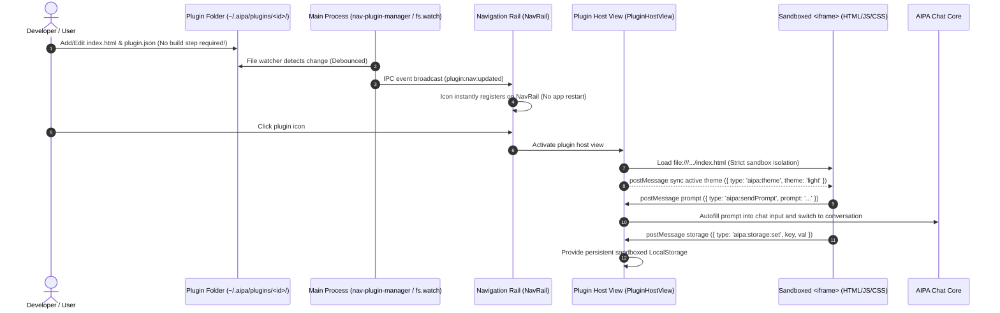
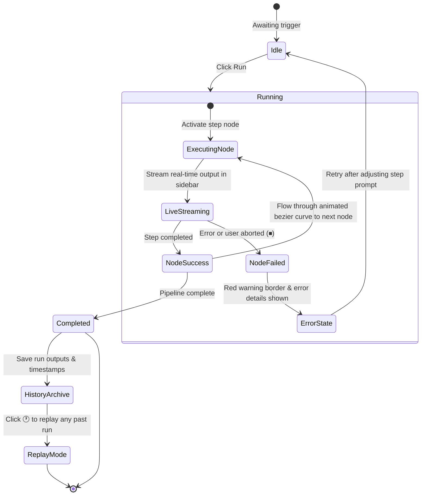
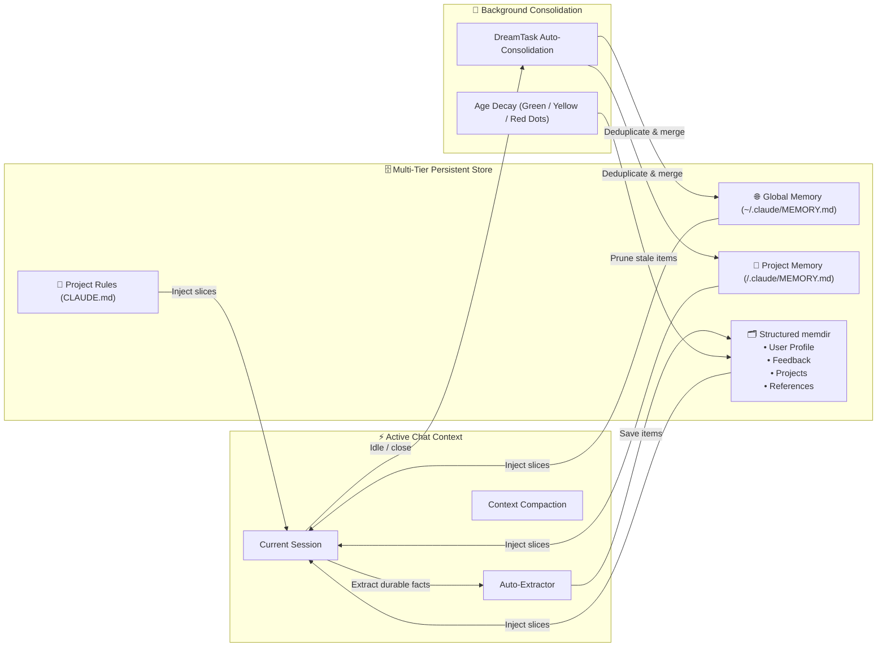

<p align="center">
  <h1 align="center">AIPA</h1>
  <p align="center">
    <strong>AI Personal Assistant — Your Always-On Desktop Agent Cockpit</strong><br/>
    Ask anything. Automate anything. Drive terminal and code, get things done.
  </p>
  <p align="center">
    
    
    
    
    
  </p>
</p>

---

AIPA is not a simple web-wrapper chat window. It is an **action-oriented desktop agent** that lives alongside you — reading and writing local files, executing shell commands, chaining tasks into automated workflows, and maintaining memory and preferences across sessions.

Under the hood, it drives **OpenAI Codex CLI** and **Claude Code CLI** as dual-core execution engines, packaged inside a finely tuned Electron + React cockpit with native multi-model support for OpenAI, Claude, DeepSeek, Ollama, and any OpenAI-compatible provider.

> 💡 **The CLI is the high-performance engine; AIPA is your intuitive cockpit.**

---

## 🏛️ System Architecture

```mermaid
graph TB
    subgraph Desktop["🖥️ User Desktop Environment (Windows 10/11)"]
        subgraph ElectronCockpit["🚀 AIPA Desktop Cockpit (Electron + React)"]
            subgraph Renderer["Renderer Layer (React 18 + Vite + Zustand)"]
                NavRail["Navigation Rail (NavRail)"]
                MainView["Main Content View (MainView)"]
                ChatPanel["Structured Chat / Tool Cards / LCS Diff"]
                DeptDashboard["Department Dashboard"]
                EmpGallery["Employees Character Icon Grid"]
                CanvasWorkflow["Canvas Workflow Editor"]
                PluginHost["Sandboxed Plugin Host"]
            end
            
            subgraph Preload["Isolation Layer (Preload / contextBridge)"]
                API["window.electronAPI (Type-safe IPC Bridge)"]
            end
            
            subgraph MainProcess["Main Process (Node.js CJS)"]
                PtyMgr["PTY Manager (node-pty ConPTY)"]
                CodexBridge["Codex Bridge (JSON-RPC 2.0 stdio)"]
                StreamBridge["Claude Bridge (NDJSON Stream)"]
                NavPluginMgr["Hot-Pluggable Plugin Watcher (fs.watch)"]
                ConfigMgr["Secure Config (DPAPI safeStorage)"]
                ClawdPet["Clawd Desktop Pet Integration"]
            end
        end

        subgraph Engines["⚡ Execution Engines & Providers"]
            CodexCLI["OpenAI Codex CLI (Rust Native Core · Primary Engine)"]
            ClaudeCLI["Claude Code CLI (Fallback Engine)"]
            LLMProviders["Multi-LLM Providers (OpenAI / Claude / DeepSeek / Ollama / Qwen)"]
        end

        subgraph LocalEnv["💻 Local Operating System"]
            Shell["Terminal Execution (PowerShell / Git Bash / CMD)"]
            FS["Workspace File System (Atomic Read/Write / Diffs)"]
            Git["Git Version Control / Worktree Isolation"]
            MemoryStore["Persistent Memory (~/.claude/projects / memdir)"]
        end
    end

    Renderer -->|postMessage / IPC| Preload
    Preload -->|IPC Channel| MainProcess
    MainProcess -->|JSON-RPC 2.0 stdio| CodexCLI
    MainProcess -->|NDJSON stdio| ClaudeCLI
    MainProcess -->|HTTP / SSE| LLMProviders
    CodexCLI --> Shell & FS & Git
    ClaudeCLI --> Shell & FS & Git & MemoryStore
```



---

## 🖥️ Desktop Cockpit Layout

AIPA adopts a modern **two-column layout** eliminating redundant intermediate lists. All core features open directly in the full-screen primary workspace:

```text
┌────────────────────────────────────────────────────────────────────────────────────────┐
│  AIPA — Desktop Agent Cockpit                                                    ─  □  ✕  │
├──────┬─────────────────────────────────────────────────────────────────────────────────┤
│ [🏢] │ Department Dashboard / Primary Chat Cockpit                                     │
│ Dept │ ┌─────────────────────────────────────────────────────────────────────────────┐ │
│      │ │ 🤖 Assistant                                                                │ │
│ [👥] │ │ Refactoring module architecture...                                          │ │
│ Emp  │ │ ┌─ 🛠️ Tool: Write (src/main/plugins/nav-plugin-manager.ts) ───────────────┐ │ │
│      │ │ │ + export interface NavPluginManifest { ... }                           │ │ │
│ [🧩] │ │ └────────────────────────────────────────────────────────────────────────┘ │ │
│Skills│ └─────────────────────────────────────────────────────────────────────────────┘ │
│      │                                                                                 │
│ [🧠] │ ┌─ Employees Character Icon Grid ─────────────────────────────────────────────┐ │
│Memory│ │  ┌─────────┐   ┌─────────┐   ┌─────────┐   ┌─────────┐   ┌─────────┐        │ │
│      │ │  │ 👨‍💻 Coach  │   │ 👩‍🔬 Analyst│   │ 🎨 Creative│   │ 📚 Tutor │   │ ⚡ Productiv│   │ │
│ [📅] │ │  │ Writing │   │ Research│   │ Partner │   │ Academic│   │  Coach  │        │ │
│ Cal. │ │  └─────────┘   └─────────┘   └─────────┘   └─────────┘   └─────────┘        │ │
│      │ └─────────────────────────────────────────────────────────────────────────────┘ │
│ ───  │                                                                                 │
│ [📝] │ ┌─ Canvas Workflow Editor ────────────────────────────────────────────────────┐ │
│Notes │ │  [Node: Read Spec] ──(flowing line)──> [Node: Code Review] ──(done)──> [Done] │ │
│ [🔌] │ └─────────────────────────────────────────────────────────────────────────────┘ │
│Plugin│ ┌─ Interaction Input Area ────────────────────────────────────────────────────┐ │
│ [⚙️]  │ Status: ● Ready | Thinking: Medium | Perm: Accept Edits | Cost: $0.04    [🐱 Clawd]│
└──────┴─────────────────────────────────────────────────────────────────────────────────┘
```

---

## 🌟 Core Capabilities

| Module | Core Features | Visual Presentation |
|---|---|---|
| **💬 Chat & Execution** | Stream-JSON real-time stream, dual-model switching, collapsible thinking chain, auto-compaction | Structured tool cards, LCS color-coded diff view, task checklist, interactive permission dialog |
| **👥 Employees** | Character persona illustrations, role-tailored attire/hairstyles, glowing status aura | Responsive icon grid, floating elevation micro-animations, one-click persona activation |
| **🎨 Canvas Workflows** | Multi-step prompt pipeline orchestration, topology graph, live output streaming, execution replay | Infinite zoom dot-grid canvas, animated bezier edge flow, inline step title rename |
| **🔌 Zero-Compile Plugins** | Vanilla HTML5+CSS+JS, sandboxed isolation, postMessage bridge SDK, dynamic directory watching | Real-time sidebar icon registration, zero-build instant reload, host developer toolbar |
| **🧩 Plugin Hub** | Unified plugin dashboard, 1-click launch, source inspection, and developer starter guide | Pre-installed at the bottom of NavRail, enables cross-plugin navigation |
| **📅 Work Calendar Plugin** | Month view with cross-day task bars, drag-to-create tasks, Codex-streamed weekly/monthly reports, GitHub & local-folder work sources, person-day tracking | One-click report generation from week badges, preview / regenerate / pull sources, file-backed storage with JSON import/export |
| **📝 Quick Notes Plugin** | Decoupled hot-pluggable plugin, live Markdown preview, category filters, pinning, AI prompt dispatch | Independent HTML micro-app, bottom NavRail placement, Ctrl+3 / Ctrl+Shift+N shortcut bindings |
| **🧠 Memory Hierarchy** | Global memory, Project memory (`.claude/MEMORY.md`), structured memdir (User/Feedback/Project/Ref) | 4-tab memory console, DreamTask background consolidation detection, decay status dots |
| **🐱 Clawd Pet** | Win32 desktop pet synced with AI thinking, execution, and idle moods | Consolidated taskbar icons, smooth sprite animations, unobtrusive companion |
| **⚙️ Settings & Channels** | MCP tool servers, OpenClaw external channels, model keys, permissions consolidated | Streamlined into Settings (Settings → MCP / Channels), keeping navigation clean |

---

## 🔌 Zero-Compilation Hot-Pluggable Plugins

AIPA introduces an accessible, zero-compilation plugin ecosystem. Authors write native HTML, CSS, and modern JavaScript without Node.js, Vite, or Webpack toolchains:



### Plugin Folder Layout
Place your tool inside `~/.aipa/plugins/<plugin-id>/`:
```text
~/.aipa/plugins/
├── welcome/               # 🧩 Plugin Hub (Pre-installed dashboard & developer starter)
│   ├── plugin.json
│   └── index.html
├── notes/                 # 📝 Quick Notes (Official hot-pluggable plugin, Markdown + AI dispatch)
│   ├── plugin.json
│   └── index.html
└── <custom-plugin>/       # 🛠️ Your Custom Micro-Tool (Zero-compilation)
    ├── plugin.json        # Manifest (ID, name, icon, location)
    ├── index.html         # Entry point (Pure HTML5)
    ├── style.css          # Styling (inherits host CSS variables)
    └── app.js             # Logic (communicates via window.postMessage)
```

### 🧩 Built-in Plugin Showcase
1. **Plugin Hub**: Provides an overview dashboard of installed plugins, one-click launching, source folder navigation in explorer, and a 3-step developer starter guide.
2. **Quick Notes**: Decoupled from hardcoded components into a hot-pluggable plugin featuring live Markdown editing/preview, category filtering (Work/Ideas/Study/Prompts/Todo), note pinning, and direct prompt dispatching to AI.
3. **Work Calendar**: Migrated from a Feishu aPaaS full-stack app (NestJS + PostgreSQL + React) into a zero-compile plugin backed by host capabilities:
   - **Calendar**: Monday-first month view with lane-packed cross-day task bars; click or drag across days to create tasks, click a bar to edit/delete; a day panel lists the selected date's tasks.
   - **AI weekly/monthly reports**: The clock icon in each week column generates that week's report (material = tasks in the period + commits/file changes from bound work sources); the corner icon merges the month's weekly reports into a monthly report. Output streams from Codex and is saved automatically; the preview dialog offers *Pull sources*, *Regenerate* (overwrites in place), copy, and send-to-chat.
   - **Work sources**: GitHub repos (owner/repo or URL, branch, author filter, token) and local folders (native folder picker, file filter); pull the current week and inspect results. Deleting a source unbinds its tasks.
   - **Reminders**: The reminders from the former left-rail *Tasks* panel now live here — in N minutes, at a specific time, or recurring via cron. They are scheduled in the main process, so system notifications fire even when the plugin is closed; clicking one opens the Work Calendar. The old *Tasks* panel is removed; existing to-dos and reminders are imported into the Work Calendar on first launch, and `Ctrl+7` now opens the Work Calendar.
   - **Tasks / Reports / Person-days**: stat cards, filters and inline status changes; report history with edit and `.md` export; weekly person-day entries with "auto-generate from tasks" (5 workdays split in 0.5 steps) and a monthly per-week rollup.
   - **Settings**: model and prompt templates (`{{period}}` / `{{material}}`), JSON import/export (tokens excluded). If Codex has no login and no API key, generation fails immediately with a clear message instead of retrying forever.

### Host capabilities (`aipa:invoke`)
Plugins declare `permissions` in `plugin.json`, then call `postMessage({ type: 'aipa:invoke', requestId, method, payload })` and receive `{ type: 'aipa:response', requestId, ok, result | error }`. Permissions are checked in both PluginHostView and the main process.

| method | permission | Description |
|---|---|---|
| `data.get` / `data.set` | `storage` | File-backed storage at `~/.aipa/plugin-data/<pluginId>/<key>.json` (atomic writes) |
| `github.commits` | `network` | GitHub commits API from the main process (branch/author filter, token, 20s timeout) |
| `fs.pickFolder` / `fs.scanFolder` | `fs` | Native folder picker; scan files modified in a date range with `*.ext` filters (skips node_modules/.git etc.) |
| `ai.generate` / `ai.abort` | `ai` | One read-only, ephemeral Codex turn streamed back via `aipa:ai:event` (delta/status/done/error) |

Multi-file plugins shipped with the app live in `electron-ui/src/main/plugins/builtin/<dir>/`, are copied to `dist` by `npm run build:plugins`, and installed into `~/.aipa/plugins/` on startup — only overwritten when the bundled version is newer. Plugin data in `plugin-data` survives upgrades.

---

## 👥 Employees Character Gallery

Replacing vertical cards, AIPA visualizes agent personas through **expressive character avatars**:

```text
                  ┌──────────────────────────────────────────────┐
                  │         Theme Radial Gradient Backdrop       │
                  │                                              │
                  │                 ╭───────────╮                │
                  │                │ 💇 Haircuts │                │
                  │                │(Tech crop / Bob / Wavy curls│
                  │                 ╭───────────╮                │
                  │                │  👀 Eyes   │                │
                  │                │  😊 Smile  │                │
                  │                 ╰───────────╯                │
                  │               👔 Tailored Role Attire         │
                  │           (Blazer / Turtleneck / Academic)   │
                  │                                              │
                  │                            ┌───────────┐     │
                  │   🟢 Online Status Ring    │ ✍️ Role    │     │
                  │   (Active Status Ring)     │   Badge   │     │
                  │                            └───────────┘     │
                  └──────────────────────────────────────────────┘
```

---

## 🎨 Canvas Workflow Engine



---

## 🧠 Memory Hierarchy & DreamTask



---

## ⌨️ Essential Keyboard Shortcuts

| Shortcut | Description | Shortcut | Description |
|---|---|---|---|
| `Ctrl+N` | New conversation | `Ctrl+Shift+P` | Open command palette |
| `Ctrl+K` | Session quick switcher (fuzzy search) | `Ctrl+F` | Search current chat |
| `Ctrl+Shift+F` | Cross-session search across files | `Ctrl+Shift+R` | Regenerate response |
| `Ctrl+Shift+K` | Compact context immediately | `Ctrl+Shift+O` | Focus mode (zen chat) |
| `Ctrl+Shift+D` | Toggle theme (Dark / Light / System) | `Ctrl+Shift+L` | Toggle language (EN / ZH) |
| `Ctrl+Shift+T` | Pin window (Always on top) | `Ctrl+,` | Open settings panel |
| `Ctrl+1 ~ 7` | Switch primary cockpit view | `Ctrl+/` | View keyboard shortcuts help |
| `Ctrl+Shift+Space` | **Global toggle AIPA window** | `Ctrl+Shift+G` | **Global clipboard query to AIPA** |

---

## 🚀 Getting Started

### 1. Clone and Install
```bash
git clone https://github.com/CipherSlinger/AIPA.git
cd AIPA/electron-ui
npm install
```

### 2. Build and Launch
```bash
# Build all targets (Main, Preload, Renderer)
npm run build

# Start the desktop application
node_modules/.bin/electron dist/main/index.js
```

### 3. Development Mode (HMR)
```bash
# Terminal 1: Start Vite renderer dev server
npm run build:main && npm run build:preload && npm run dev:renderer

# Terminal 2: Run Electron pointing to Vite
NODE_ENV=development node_modules/.bin/electron dist/main/index.js
```

---

## 🛡️ Security

- **Encrypted Secrets**: API keys stored with OS-level encryption (`electron.safeStorage` / Windows DPAPI).
- **Process Sandbox**: Plugins execute in sandboxed `<iframe>`s with zero access to Node.js APIs.
- **Granular Permissions**: 5-level tool permission control (Default / Accept Edits / Don't Ask / Plan Only / Bypass).
- **Environment Sanitization**: Clean environment variable whitelists passed to child processes.

---

## 📄 License

Distributed under the [MIT License](LICENSE).
